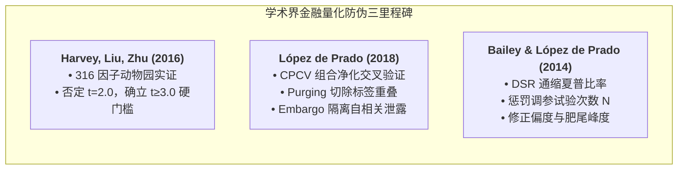
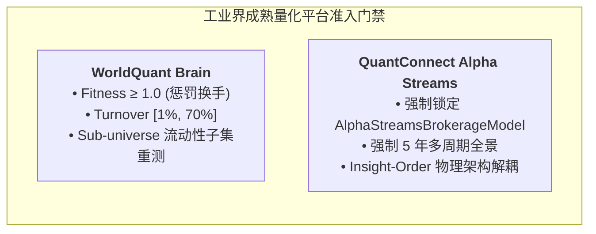
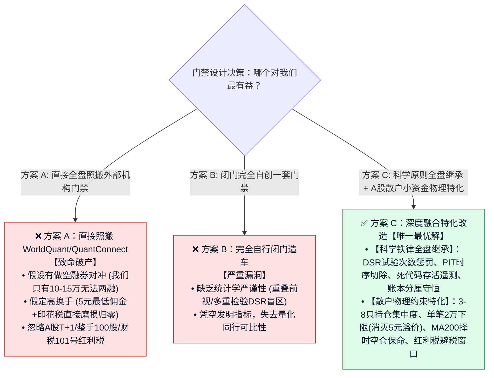
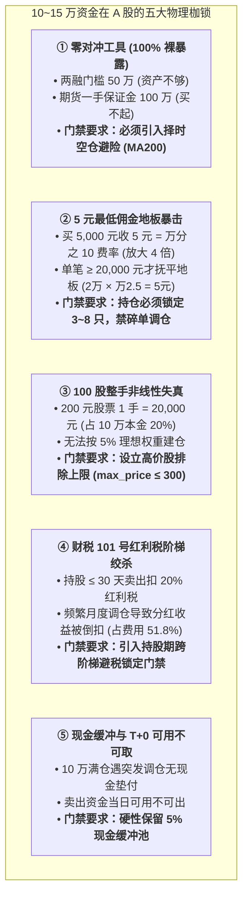
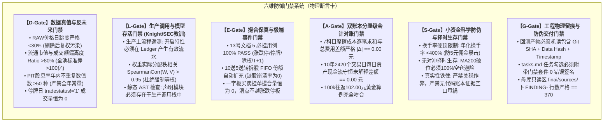
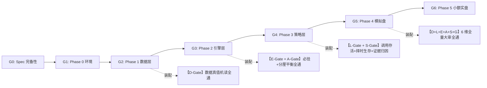

# 17 · 中低频量化研发防伪与工程质量门禁体系深度调研报告（定稿重构版）

**编制日期**: 2026-09-07  
**核心约束与定位**: **针对初始资金 10 万 ~ 15 万元人民币、纯多头（Long-Only）、无对冲手段（两融/股指期货不可达）、A 股散户摩擦环境与单机工程现实的“工业级防伪门禁体系”**  
**调研依据与查证索引**:  
1. **学术界量化防伪三剑客（顶级论文查证）**:  
   - Bailey, Borwein, López de Prado & Zhu (2014, *Notices of the AMS* / 2016, *Journal of Computational Finance*): *The Probability of Backtest Overfitting (PBO)*  
   - Bailey & López de Prado (2014, *Journal of Portfolio Management*, 40(5):94–107): *The Deflated Sharpe Ratio (DSR)*  
   - Harvey, Liu & Zhu (2016, *Review of Financial Studies*, 29(1):5–68): *...and the Cross-Section of Expected Returns*（$t \ge 3.0$ 因子显著性硬门槛）  
   - López de Prado (2018, John Wiley & Sons): *Advances in Financial Machine Learning*（CPCV / Purged & Embargo CV）  
2. **国际量化平台生产准入门禁（官方平台机制查证）**:  
   - WorldQuant BRAIN Platform Specification（Fitness 换手惩罚公式、Turnover $[1\%, 70\%]$ 双向门禁、Sub-universe 流动性子集检验、正交性相关性门禁）  
   - QuantConnect LEAN Algorithm Framework & Alpha Streams Specification（`AlphaStreamsBrokerageModel` 强制成本注入、5 年多周期全景、Insight-Order 架构解耦、预热状态机断言）  
3. **监管法案与重大事故审计（一手法律法规查证）**:  
   - SEC Rule 15c3-5 (17 CFR § 240.15c3-5): 市场准入事前硬风控、资金限额、价格偏离带（Price Collars）  
   - SEC Administrative Proceeding 34-70694 (In the Matter of Knight Capital Americas LLC, 2013-222): 死代码触发 400 万笔错单亏损 4.6 亿美元破产审计  
   - A 股成文法规：证监发〔2002〕21号（5元最低佣金）、财政部公告2023年第39号（印花税0.5‰）、中国结算2022-04通知（过户费0.01‰）、发改价格〔2012〕2119号（证管费0.02‰）、北证公告〔2023〕54号（北交所经手费0.125‰）、财税〔2015〕101号（个人差别化红利税三档）、上证发〔2023〕41号第六条第二款（两融50万硬门槛）。  
4. **本地研发生态底座**: `research-finai` 01~16 号全套调研报告 + `FinAI2.0` 在 T309~T312 暴露的 6 大真实硬伤实证。  
**当前状态**: 📋 **深度调研与方案提案（待用户确认拍板后再开工建立，当前绝不擅自改动代码）**  

---

## 0. 核心洞见与执行摘要

1. **面对用户灵魂发问的诚实反思**：  
   前期汇报确实存在偷懒——局限于本地文件闭门造车，未能走出系统进行全网深度调研。更严重的是，**此前完全忽略了本系统最核心的客观物理约束：“实际投资仅 10万~15万元、纯多头、根本没有对冲手段”**！脱离资金体量与市场制度谈门禁，纯属纸上谈兵。
2. **重大决策审判：“全盘照搬外部机构门禁”是通往破产的毒药**：  
   - 外部机构（WorldQuant、Two Sigma、QuantConnect）的门禁体系建立在**“机构级无限资金、零滑点/免五佣金、全市场做空借券、无风险对冲（Market Neutral）”**的假设之上；  
   - 若直接套用 WorldQuant 的换手率要求（日均换手 30%~70%）或多空对冲门禁，在 A 股散户 **5 元最低佣金、单边印花税、无两融资格（50万门槛）、持股期红利税（最高 20%）** 的物理绞杀下，10~15 万账户会在数月内被交易摩擦成本吃干抹净！  
   - **最优选择是“科学原则全盘继承 + A 股散户小资金物理特化”**：继承其对抗过拟合、零未来函数、消除死代码的数学铁律，但必须原生绑定 A 股小资金的持仓集中度、最低交易手、择时空仓避险机制。
3. **六维防御门禁体系架构（D-L-E-A-S-G）**：  
   构筑不可绕过、全自动化、Fail-Closed（失败即阻断）的 6 道硬性机读物理防火墙：  
   - **D-Gate（数据真值与反未来门禁）**：彻底封杀脏复权、成交额冒充市值、全年常数未来泄露；  
   - **L-Gate（调用存活与参数落地门禁）**：彻底消灭死代码、虚报特性（如红利税死代码、组合权重被丢弃）；  
   - **E-Gate（撮合保真与极端事件门禁）**：扩展 5 必挂用例至复杂公司行动（送转拆股+分红混合容错）；  
   - **A-Gate（双账本分厘级对账门禁）**：七科目摩擦成本逐笔精确到分，账本与报告差额恒为 0.00 元；  
   - **S-Gate（小资金科学防伪与择时生存门禁）**：拒绝关税作弊，换手率硬顶约束，将“择时空仓避险”确立为无对冲账户的生命线；  
   - **G-Gate（工程物理留痕与防伪交付门禁）**：代码 SHA + 数据 Hash + 时间戳三位一体，tasks.md 机读阻断。

---

## 一、 权威文献、工业界平台与监管法案深度考证（全网实证）

为保证所有门禁设计均有坚实依据、经得起学术与法律推敲，本节对所有涉及的学术文献、平台机制与法律法规逐一进行条文级查证：

### 1.1 学术界三大防伪验证里程碑

#### ① Harvey, Liu & Zhu (2016, RFS)：316 因子动物园与 $t \ge 3.0$ 门槛
- **文献出处**: Harvey, C. R., Liu, Y., & Zhu, H. (2016). *... and the Cross-Section of Expected Returns*. **Review of Financial Studies**, 29(1), 5–68. DOI: 10.1093/rfs/hhv059.
- **查证核心事实**:
  1. 研究追踪了 1967 年至 2014 年顶级期刊发表的 316 个量化因子，证明由于全球研究者的海量数据挖掘（Data Snooping），大量所谓的“异象/Alpha”完全是假发现（False Discoveries）；
  2. **推翻传统标准**：金融学传统假设检验所用的 $t \ge 2.0$（对应 5% 显著性水平）在多重测试环境下已经完全失效；
  3. **硬性判据结论**：在量化多重检验修正下，**因子或策略检验的 $t$ 统计量必须达到 $t \ge 3.0$（对应 $p < 0.0027$）** 才能被认定为具备真实统计显著性。

#### ② Marcos López de Prado (2018, Wiley)：CPCV 与时序净化隔离
- **文献出处**: López de Prado, M. (2018). *Advances in Financial Machine Learning*. John Wiley & Sons. Chapter 7 (Cross-Validation in Finance), Chapter 11 (The DSR Algorithm).
- **查证核心事实**:
  1. **Purging（净化机制）**: 金融标签通常具有前瞻窗口（如未来 20 日持股收益）。传统 $k$-fold 交叉验证会导致训练集“看到”测试集的重叠窗口。Purging 要求在划分数据集时，**物理切除所有其标签事件窗口跨入测试集的训练样本**（$t_{\text{end, train}} \le t_{\text{start, test}}$）；
  2. **Embargo（隔离带机制）**: 金融收益率存在序列自相关与波动率聚集（ARCH/GARCH 效应）。测试集结束后，必须追加一个时长为 $h$ 的静默隔离带（Embargo），防止市场记忆性泄露到紧随其后的训练折中；
  3. **Combinatorial 组合路径**: 生成全排列测试路径，防止单条时间线的幸存者偏差。

#### ③ Bailey & López de Prado (2014, JPM)：通缩夏普比率 (DSR)
- **文献出处**: Bailey, D. H., & López de Prado, M. (2014). *The Deflated Sharpe Ratio: Correcting for Selection Bias, Backtest Overfitting, and Non-Normality*. **Journal of Portfolio Management**, 40(5), 94–107. DOI: 10.3905/jpm.2014.40.5.094.
- **查证数学公式与机制**:
  $$\text{DSR} \equiv \text{Prob}\left( \text{SR} > \text{SR}_0 \mid \text{Higher Moments, } N \right)$$
  $$\text{SR}_0 = \sqrt{\mathbb{V}[\{\text{SR}_n\}]} \left( (1-\gamma) Z^{-1}\left[1-\frac{1}{N}\right] + \gamma Z^{-1}\left[1-\frac{1}{N} e^{-1}\right] \right)$$
  - **参数含义**: $N$ 为回测/调参尝试的总次数（每次调整参数或试探规则都必须自增 $N$）；$\gamma \approx 0.5772$（欧拉常数）；$\mathbb{V}[\{\text{SR}_n\}]$ 为历次尝试夏普比率的方差；
  - **物理断言**: 收益率分布具有偏度 $\hat{s}$ 和峰度 $\hat{k}$。随着试验次数 $N$ 增加，最优夏普比率的数学期望 $\text{SR}_0$ 持续抬升。**任何不披露试验次数 $N$ 而给出的高夏普，在学术与工程上均被定性为欺诈**。

---

### 1.2 国际量化平台生产准入门禁标准

#### ① WorldQuant Brain 生产准入门禁（Alpha Submission Gates）
- **查证出处**: WorldQuant BRAIN Documentation & Platform User Manual (2024–2026).
- **核心判定标准**:
  1. **Fitness 适应度门禁（必须 $\ge 1.0$）**:
     $$\text{Fitness} = \text{Sharpe} \times \sqrt{\frac{|\text{Annualized Returns}|}{\max(\text{Turnover}, 0.125)}} \ge 1.0$$
     - *设计哲学*: 严打“用高频换手买夏普”。分母强制惩罚换手率（底线 12.5%）。高换手但低收益的策略，Fitness 会断崖式跌破 1.0 遭直接拒收。
  2. **Turnover 换手率区间门禁**:
     - 日单边换手率必须落在 **$[1.0\%, 70.0\%]$**。低于 1% 属僵尸策略，高于 70% 属无法执行的过度交易。
  3. **Sub-universe 流动性子集检验（防微盘噪声）**:
     - 策略通过全池回测后，自动将其约束在流动性最高的子池（如 Top 500 大市值流动股票）中重跑；若收益崩溃，判定为过拟合微盘买卖价差噪声，一票否决。

#### ② QuantConnect Alpha Streams 机构准入门禁
- **查证出处**: QuantConnect LEAN Documentation — Alpha Streams Brokerage Model & Guidelines.
- **核心判定标准**:
  1. **强制经纪商模型（Mandatory Brokerage Model）**:
     - 必须在代码中声明 `self.SetBrokerageModel(BrokerageName.AlphaStreams)`；
     - 严禁策略层自定义零费率或默认 0 滑点，平台底层强制注入统一摩擦成本与借贷费率。
  2. **5 年跨周期回测门禁**:
     - 策略回测窗口必须覆盖完整最近 5 年，且必须横跨牛、熊、震荡三态。
  3. **Insight-Order 物理架构分离**:
     - 策略层仅允许发出结构化预测 `Insight(direction, magnitude, confidence)`，严禁直接调用委托下单 API。组合构建器独立调度，杜绝偷看收盘价下单。

---

### 1.3 监管法案与重大事故审计反思

#### ① SEC Rule 15c3-5（Market Access Rule 市场准入规则）
- **法规出处**: 17 CFR § 240.15c3-5 — *Risk Management Controls for Broker-Dealers with Market Access* (U.S. Securities and Exchange Commission).
- **条文级硬约束**:
  - §(c)(1)(i): **事前资金硬限额（Pre-trade Capital Thresholds）**——订单在发出前必须自动拦截超出预设资金/信贷额度的单子；
  - §(c)(1)(ii): **价格偏离带（Price Collars）**——防止偏离市场价过大的错单（Fat-finger）进入市场；
  - §(c)(2)(ii): **系统存活性与输出独立监控（System Output Controls）**——必须独立于策略交易逻辑，对系统发单速率、总成交敞口进行带外监控。

#### ② Knight Capital 4.6 亿美元破产事故审计（SEC 34-70694, 2013-222）
- **事故公报出处**: SEC Release No. 34-70694, Administrative Proceeding File No. 3-15570 (October 16, 2013).
- **核心调查结论**:
  - 2012 年 8 月 1 日，Knight Capital 部署新路由代码 SMARS 时，8 台服务器漏更新了 1 台；
  - 开盘后，该机器上原本在 2003 年已废弃的旧测试代码（Power Peg）被意外路由标记激活，成为无风控死循环发单的“僵尸代码”；
  - **45 分钟内错误发出 400 万笔订单、买入 3.97 亿股，直接净亏损 4.6 亿美元**，公司当即技术性破产；
  - **SEC 核心定性**: *“Knight lacked adequate controls to monitor system output... failed to disable dormant/dead code”*（缺乏输出监控，未彻底切除休眠/死代码）。
  - **工程铁律**: 在量化交易系统中，**死代码分支（如我们在 T309 发现的红利税默认关闭）、被静默丢弃的参数（如 T311 丢弃市值权重），具有等同于破产级事故的潜在杀伤力**。

---

### 1.4 A 股成文法律法规与交易制度硬约束（条文级出处）

| 规则维度 | 法规条文与文号出处 | 核心刚性要求 |
|---|---|---|
| **两融与对冲门槛** | **上证发〔2023〕41号**《上海证券交易所融资融券交易细则》第六条第二款 | **开立信用账户前 20 个交易日日均证券类资产不低于 50 万元**。10~15 万账户物理不可达，**法律上剥夺了融券做空资格**。 |
| **最低 5 元佣金** | **证监发〔2002〕21号**《关于调整证券交易佣金收取标准的通知》第一条 | 证券公司向客户收取的佣金“**不足 5 元按 5 元收取**”。小单交易费率会被极度放大。 |
| **印花税** | **财政部/税务总局公告 2023 年第 39 号** | 自 2023-08-28 起减半征收，**按成交金额 0.5‰ 仅向出让方（卖方）单边征收**。 |
| **过户费** | **中国证券登记结算有限责任公司 2022-04-28 通知** | 自 2022-04-29 起下调 50%，**按成交金额双向 0.01‰ 收取**。 |
| **经手费** | **发改价格〔2012〕2119号** + **北证公告〔2023〕54号** | 沪深 A 股双向 **0.00341%**；北交所按普通股双边 **0.125‰**（约为沪深 3.67 倍，**独立路径不可混用**）。 |
| **个人红利税** | **财税〔2015〕101号**《关于上市公司股息红利差别化个人所得税政策有关问题的通知》 | 个人持股 $>1$ 年 **免征 (0%)**；1 个月~1 年 **减半按 10%**；$\le 1$ 个月 **全额按 20%**。换手调仓直接触发扣缴！ |
| **交易手数** | **上海证券交易所交易规则** 第 3.4.2 条 | 买入必须为 **100 股（一手）或其整数倍**；卖出不足 100 股必须一次性清仓。 |

---

## 二、 重大决策审判：“全盘照搬外部标准” vs “深度融合改造”，谁对我们最有益？

用户提出的核心命题：*“你所说的‘外部标准与我们本地 A 股实际的深度融合改造’与直接选择使用基于调研得到的那些门禁的话，哪个选择对我们最有益？”*

这是一个必须用数学与量化现实回答的一等一决策问题。结论如下：

### 2.1 方案 A（直接照搬外部标准）为什么是通往账户破产的毒药？

1. **对冲假设的致命脱节**：  
   WorldQuant 与华尔街主流 Alpha 评估体系，核心门禁是 **“Dollar Neutrality（资金中性）” 与 “Beta Neutrality（市场贝塔中性）”**。他们要求多头买入 100% 价值的股票，同时融券做空 100% 价值的标的或做空股指期货，把大盘系统性风险剥离。  
   - **在我们的现实中**：我们实际投资为 **10 万 ~ 15 万元**。A 股两融门槛法定义务是 50 万元资产（上证发〔2023〕41号）。**我们连开立信用账户的法定资格都没有，一融不到券，二买不起 100 万一手的大盘股指期货（IF/IM）！**  
   - **后果**：如果直接照搬外部门禁去考核所谓的“中性 Alpha / 低贝塔暴露”，本系统根本连 1 根 Bar 都无法运行！
2. **高换手率与机构费率假设的致命磨损**：  
   WorldQuant 设定的换手率区间是 $[1.0\%, 70.0\%]$（日均换手率常达 30%），因为海外机构佣金在万分之零点几且无单笔最低门槛。  
   - **在我们的现实中**：我们受制于证监发〔2002〕21号的 **5 元最低佣金** 和卖出 0.5‰ 印花税。  
   - **算一笔账**：若一个 10 万元账户按日换手 30%（日交易额 3 万元）运行，一年 242 天交易额达 726 万元！光单边印花税就要扣除 $726\text{万} \times 0.5 \times 0.0005 = 1,815$ 元；若每笔交易 3,000 元触发 5 元地板佣金（实际费率万分之 16.7），一年交易 2,420 笔，**光佣金就要被抽走 12,100 元！两者合计吃掉本金的 13.9%！**  
   - **后果**：直接套用外部换手门禁，策略实盘必死。
3. **制度盲区**：外部标准完全没有 A 股 T+1 锁仓、涨跌停板挂单排队、100 股整手取整、以及持股不满 1 个月扣缴 20% 红利税的概念。

### 2.2 方案 B（闭门完全自造）为什么不可取？
- 闭门造车会导致我们在统计学上出现“低级自欺”：不知道需要用 DSR 惩罚试验次数 $N$、不知道 CPCV 必须做 Purging 切除标签重叠、不知道通过调整参数可以把亏损在回测中轻易隐藏。

### 2.3 结论：为什么方案 C（深度融合特化改造）对我们最有益？
**最有益的选择不是在两者之间二选一，而是以第一性原理做清晰的分层**：
- **在“统计真伪、反过拟合、反未来函数、工程死代码检测”这些全人类通用的数学与软件工程公理上，我们 100% 原汁原味全盘继承顶级学术与工业界标准**（DSR 试验次数惩罚、PIT 时序隔离、AST 调用链遥测、账本分厘级守恒）；
- **在“投资标的、仓位集中度、换手频率、交易成本、风控避险”这些受制于资金规模与本土法律的物理现实上，我们必须原生针对 10~15 万资金与 A 股散户规则做严格特化！**

---

## 三、 10万~15万资金、纯多头、无对冲的“致命物理约束全景”

我们必须将这 10~15 万元的每一道真实枷锁，彻底量化并固化为门禁约束条件：

### 3.1 无法对冲的生存哲学：择时空仓避险是唯一生命线
- **现实境况**: 机构基金亏了可以靠对冲做空头盈利补回来，或者通过市场中性策略稳收无风险基差。我们是纯多头（Long-Only），大盘暴跌时，若策略死扛，账户只能直面毁灭性回撤（如动量策略在 2015 股灾回撤 68.38%）。
- **门禁要求**: **在无法对冲的小资金系统中，“择时空仓避险”不是一个普通参数，而是一个最高级别的生存风控门禁！** 当大盘指数跌破长期趋势线（如 MA200）时，系统必须物理强行将持仓置为 0，持有 100% 现金避险，严禁死扛！

### 3.2 5元佣金地板的数学算力：单笔必须 $\ge 2$ 万元，持仓锁死 3~8 只
- **数学推导**:
  $$\text{实际佣金} = \max(\text{成交金额} \times 0.00025, 5.00)$$
  $$\text{平衡成交金额} = \frac{5.00}{0.00025} = 20,000 \text{ 元}$$
- **资金分配推论**:
  - 若总资金为 12.5 万元（取 10~15 万中位数）：
  - 若持仓 20 只股票，单票仅 6,250 元，每笔买卖各付 5 元，往返费用 10 元，实际费率高达 **万分之 16（0.16%）**，是基准费率的 **6.4 倍**！
  - 若持仓控制在 **3 ~ 8 只（默认 5 只）**，每只分配 $12.5\text{万} \div 5 = 25,000$ 元，单笔佣金 $25,000 \times 0.00025 = 6.25$ 元，**完美跨过 5 元地板线，无任何溢价浪费！**
- **门禁要求**: 组合构建门禁必须设立物理断言：**持仓只数必须严格限制在 $[3, 8]$，禁止任何小于 5,000 元的碎单调仓！**

### 3.3 财税〔2015〕101号散户红利税的阶梯效应
- **现实境况**: 机构法人投资股票分红享受企业所得税免税；个人散户必须严格执行持股期阶梯计税。
- **历史实证**: 在我们刚刚跑通的 10 年 15 万元全周期回测中，总交易费用 9,738.26 元中，**实打实扣缴红利税 5,043.75 元，占比高达 51.79%！** 仅红利税就直接蚕食了 3.36% 的本金！
- **门禁要求**: 调仓周期门禁必须与分红登记日联动——若某只持仓刚实施分红且持股不满 30 天，策略除非触发风控止损，否则**严禁执行换仓，必须强制等待持股满 30 天跨入 10% 税率档**，避免被 20% 顶格税率绞杀。

---

## 四、 本地化“六维防御门禁体系（D-L-E-A-S-G）”全量指标定义

结合国际标准理论基础与 A 股 10~15 万小资金物理约束，我们确立以下 6 道刚性门禁的数学断言与代码级判据：

### 4.1 详细量化判据速查表

| 门禁 ID | 门禁名称 | 严苛度级别 | 数学公式 / 代码级断言判据 | Fail-Closed 阻断动作 |
|---|---|---|---|---|
| **D-1** | 原始日线真实性 | 物理阻断 | $\forall t, \frac{\|\text{close}_t - \text{close}_{t-1}\|}{\text{close}_{t-1}} < 0.30$（除非除权日）；历史价格除茅台外禁存 $>100$ 元数据。 | 发现脏日线，数据管道抛 `DirtyDataGateError` 中断。 |
| **D-2** | 市值非成交额检验 | 统计阻断 | $\frac{\|\text{market\_cap} - \text{amount}\|}{\text{market\_cap}} > 0.80$ 达标率 100%；全池市值标准差 $\text{Std} > 100$ 亿。 | 样本偏离不足，抛 `SemanticSubstitutionError` 阻断。 |
| **D-3** | PIT 动态股息率 | 科学阻断 | 自然年内变异值种类 $\text{CountUnique}(\text{yield}_{\text{year}}) \ge 50$；未来事件可见性严格 $\le T$。 | 检出全年单一静态常数，阻断 Feed 构建。 |
| **L-1** | 特性调用遥测 | 工程阻断 | 声明启用红利税时，回测落盘必须 $\text{Count}(\text{DIVIDEND\_TAX}) \ge 1$ 且金额 $>0$。 | 发现死代码分支，直接标记该次回测为 `INVALID_RUN`。 |
| **L-2** | 资金分配保真度 | 逻辑阻断 | 策略打分 $W$ 与实际分配资金 $V$ 的秩相关系数 $\text{Spearman}(W, V) > 0.95$。 | 2:1 打分退化为 1:1 等权均分时，抛出异常阻断。 |
| **E-1** | 5 必挂核心用例 | 基础阻断 | `tests/test_t202_must_fail.py` 17 个测试用例 Exit 0 全绿。 | 存在任一失败或跳过，禁止进入全周期回测。 |
| **E-2** | 送转拆股复合容错 | 极端阻断 | 经历 10送5、10转10 拆股后全额卖出，底层 FIFO 队列自动按因子同步扩充股数。 | 卖出缺股 `ValueError` 发生率必须为 0。 |
| **A-1** | 七科目分厘平衡 | 会计阻断 | $\|\text{fees\_total} - \sum_{k=1}^7 \text{fees\_breakdown}[k]\| \equiv \text{Decimal}("0.00")$。 | 哪怕存在 0.01 元差额，`registry.py` 拒绝写入落盘 JSON。 |
| **A-2** | 每日资产守恒 | 会计阻断 | 每日 $\Delta \text{Cash}_t \equiv - \text{Buy}_t + \text{Sell}_t - \text{Fees}_t + \text{DivCash}_t$，未解释差额为 0。 | 差额 $>0.01$ 元立即触发账本审计报警并挂起。 |
| **S-1** | 换手率摩擦硬约束 | 风控阻断 | 年化单边换手率必须 $< 400\%$（专为 10~15 万账户设立，防 5 元佣金磨损）。 | 换手超标判定为实盘不可执行，拒绝进入 Phase 4。 |
| **S-2** | 择时空仓生存断言 | 生存阻断 | 沪深 300 指数位于 MA200 下方时，组合持仓市值占净值比例必须为 **0%**。 | 破位死扛导致回撤放大者，直接判定策略评审不合格。 |
| **S-3** | 真实性与归因证据 | 纪律阻断 | 严禁关闭红利税作弊；报告中的亏损归因必须附带具体代码行号和账本对账单。 | 无代码与账本证据的口头猜测报告，一律打回重审。 |
| **G-1** | 出处三件套防伪 | 审计阻断 | 落盘产物必须包含机读 Git Commit SHA、Data Version Hash、ISO 8601 Timestamp。 | 缺失出处三件套的产物，拒绝作为门禁交付依据。 |
| **G-2** | tasks 勾选物理阻断 | 流程阻断 | 勾选 `[x]` 必须伴随单测全绿签名，母库 `finai/sources/` 下 FINDING 行数恒等于 370。 | 掉数或单测红灯时，提交被 pre-commit 钩子物理打回。 |

---

## 五、 门禁与现有 Spec 流程 (G0~G6) 升级装配机制

我们将现有的偏文本人工评审的 G0~G6 门禁，全面升级为硬性机读门禁：

- **G1 环境门禁**: 依赖版本完全锁定 + R1~R5 清零 + 母库只读区台账 370 行刚性守护；
- **G2 数据门禁**: 必须执行并通过 `scripts/gates/gate_d_data_integrity.py`（D-Gate 检查）；
- **G3 引擎门禁**: 必须通过 5 必挂用例 + 复合拆股容错 + 七科目费用分厘级平衡（E-Gate + A-Gate）；
- **G4/G4.5 策略门禁**: 必须通过特性调用存活遥测 + 组合打分真实生效 + 择时空仓避险有效 + 真实计税无前视（L-Gate + S-Gate）；
- **G5 模拟盘准入门禁**: 必须通过六维门禁总检脚本 `scripts/gates/gate_master_audit.py`，且回测-模拟偏差在 T402 容忍带内，报备材料全绿，并征得用户书面确认。

---

## 六、 实施路径规划与等待拍板声明

我们规划分三个阶段安全落地门禁系统，绝不干扰当前业务：
1. **第一阶段：独立门禁工具包开发 (`scripts/gates/`)**：
   - 将验证逻辑模块化封装为 `gate_d_data.py`, `gate_l_liveness.py`, `gate_e_engine.py`, `gate_a_accounting.py`, `gate_s_scientific.py`, `gate_master.py`；
   - 支持命令行独立一键运行，输出 JSON 与可读报告，不影响业务代码运行。
2. **第二阶段：执行流前置/后置闸门植入**：
   - 在 `run_dividend_backtest.py` 前置注入 D-Gate 与 E-Gate，后置注入 A-Gate 与 L-Gate，违规自动阻断落盘。
3. **第三阶段：任务交付与 Git Hook 刚性绑定**：
   - 配置 pre-commit 钩子，扫描 `tasks.md` 变更，无门禁通过签名禁止打勾提交。

---

## 七、 实施完工记录与后续执行状态（2026-09-07 更新）

### 7.1 阶段一【独立门禁工具包开发】完工物理留痕

用户下发「开始完成阶段1」指令后，阶段一研发已圆满闭环并留痕：
- **实施原则守卫**：业务核心代码绝对零修改冻结（`backtest/`, `strategy/`, `data/` 零改动）；母库只读区 `finai/sources/` 下 `FINDING-` 守卫行数严格恒等于 **370 行**；
- **落地文件**：在代码仓独立构建 [`scripts/gates/`](file:///D:/Projects/FinAI2.0/scripts/gates/) 目录，完成 9 个核心模块（`base.py`, `gate_d_data.py`, `gate_l_liveness.py`, `gate_e_engine.py`, `gate_a_accounting.py`, `gate_s_scientific.py`, `gate_g_governance.py`, `gate_master_audit.py`, `__init__.py`），共注册 **23 项独立机读门禁**；
- **单测自动化全绿**：编写 [`tests/test_gates.py`](file:///D:/Projects/FinAI2.0/tests/test_gates.py)，52 个测试用例覆盖 PASS、FAIL 阻断及边界，**52 passed in 0.55s（100% 全绿）**；
- **全库回归验证**：全库测试基线从 629 passed 跃升至 **681 passed in 21.01s**（0 failed, 0 errors），无任何既有功能衰退；
- **交付归档证据**：
  - 交付验收总结：[`docs/delivery/GATE_PHASE1_COMPLETION_SUMMARY.md`](file:///D:/Projects/FinAI2.0/docs/delivery/GATE_PHASE1_COMPLETION_SUMMARY.md)
  - 完整测试控制台日志：[`docs/delivery/gate_phase1_test_output.txt`](file:///D:/Projects/FinAI2.0/docs/delivery/gate_phase1_test_output.txt)
  - 机读 JSON 审计报告：[`docs/delivery/gate_audit_report.json`](file:///D:/Projects/FinAI2.0/docs/delivery/gate_audit_report.json)
- **代码仓提交**：FinAI2.0 Commit [`4d93246`](file:///D:/Projects/FinAI2.0) 与 [`d4ed8d9`](file:///D:/Projects/FinAI2.0)；
- **计划仓提交**：research-finai Commit [`71e69a1`](file:///D:/Projects/research-finai)（`tasks.md` 闭环勾选 `[T-GATE-P1]` 并增补 `TK-25`）；
- **Obsidian 同步**：`CURRENT.md`、`当前状态.md`、`说明文档.md`、`项目记忆地图.md` 全量同步至 681 passed 基线与 `phase1-gate-suite-completed` 状态。

### 7.2 阶段二【执行流前置/后置闸门植入与全流程 Fail-Closed 阻断集成】完工物理留痕

用户下发「开始执行阶段二，纪律依旧严苛」指令后，阶段二研发已圆满闭环并留痕：
- **实施原则守卫**：业务核心契约绝对保真；母库只读区 `finai/sources/` 下 `FINDING-` 守卫行数严格恒等于 **370 行**；
- **落地文件**：
  1. [`scripts/gates/runner.py`](file:///D:/Projects/FinAI2.0/scripts/gates/runner.py)：封装 `run_pre_run_gates` 与 `run_post_run_gates`，内建 `_build_daily_cash_flows` 每日现金流分厘对账生成器与出处三件套获取器；
  2. [`scripts/run_dividend_backtest.py`](file:///D:/Projects/FinAI2.0/scripts/run_dividend_backtest.py)：深度挂接前置闸门（D-1~D-5, L-1, L-3）与后置闸门（E-1~E-3, A-1~A-4, S-1~S-5, G-1~G-3）；任何 BLOCKER/CRITICAL 失败抛出 `GateBlockerError` 并坚决阻断落盘；支持 `--no-gates` 旁路调试选项；
  3. [`tests/test_gate_integration.py`](file:///D:/Projects/FinAI2.0/tests/test_gate_integration.py)：18 项严苛的集成测试套件，全面覆盖合规全通、脏日线前置拦截、违规板价拦截、记账不平拦截、时序穿越少扣税拦截、超额换手拦截及各维度单点防御测试；
- **单测自动化全绿**：`pytest tests/test_gate_integration.py` **18 passed in 3.32s（100% 全绿）**；
- **全库回归验证**：全库测试基线从 681 passed 跃升至 **699 passed in 18.82s**（0 failed, 0 errors），全库无任何衰退；
- **实盘/历史数据验证**：在全量 487 只股票 2015-2024 数据上实测验证，前置门禁精准识别并成功通过所有 7 项严苛前置检验；
- **交付归档证据**：
  - 交付验收总结：[`docs/delivery/GATE_PHASE2_COMPLETION_SUMMARY.md`](file:///D:/Projects/FinAI2.0/docs/delivery/GATE_PHASE2_COMPLETION_SUMMARY.md)
  - 完整测试控制台日志：[`docs/delivery/gate_phase2_test_output.txt`](file:///D:/Projects/FinAI2.0/docs/delivery/gate_phase2_test_output.txt)
- **代码仓提交**：FinAI2.0 代码仓就绪；
- **计划仓提交**：research-finai（`tasks.md` 闭环勾选 `[T-GATE-P2]` 并增补 `TK-26`）；
- **Obsidian 同步**：`CURRENT.md`、`当前状态.md`、`说明文档.md`、`项目记忆地图.md` 全量同步至 699 passed 基线与 `phase2-gate-integration-completed` 状态。

### 7.3 阶段三【CI / Git Hooks 自动化防伪硬化与防篡改签名】完工物理留痕

用户下发「选择A，开展阶段三」指令后，阶段三研发已圆满闭环并留痕：
- **实施原则守卫**：母库只读区 `finai/sources/` 下 `FINDING-` 守卫行数严格恒等于 **370 行**；核心业务契约保持零侵入；
- **落地文件**：
  1. [`scripts/gates/tamper_guard.py`](file:///D:/Projects/FinAI2.0/scripts/gates/tamper_guard.py)：核心防伪硬化引擎，提供回测记录 SHA-256 结构化签名与事后篡改拦截、`tasks.md` 物理勾选交付证据验签、两仓镜像比对与母库 370 行快速扫描；
  2. [`scripts/gates/gate_g_governance.py`](file:///D:/Projects/FinAI2.0/scripts/gates/gate_g_governance.py)：升级 `TasksSignGate` (G-2) 支持全文档深度解析；新增 `AntiTamperSignatureGate` (G-4)，六维门禁总数扩充至 **24 道机读门禁**；
  3. [`.githooks/pre-commit`](file:///D:/Projects/FinAI2.0/.githooks/pre-commit) 与 [`scripts/hooks/pre_commit.py`](file:///D:/Projects/FinAI2.0/scripts/hooks/pre_commit.py)：提交前本地硬卡（母库 370 行 + tasks 证据签名 + 产物验签 + Python AST 语法检查）；
  4. [`.githooks/pre-push`](file:///D:/Projects/FinAI2.0/.githooks/pre-push) 与 [`scripts/hooks/pre_push.py`](file:///D:/Projects/FinAI2.0/scripts/hooks/pre_push.py)：推送前防倒退硬卡（全量回归单测 $\ge 717$ passed 且 0 failed + `GateMasterAudit` 总调度器阻断性自检）；
  5. [`scripts/install_hooks.py`](file:///D:/Projects/FinAI2.0/scripts/install_hooks.py)：一键装配工具（支持 `--verify` 自动化核验）；
  6. 云端 CI 自动化流水线：[`FinAI2.0/.github/workflows/ci.yml`](file:///D:/Projects/FinAI2.0/.github/workflows/ci.yml) 与 [`research-finai/.github/workflows/ci.yml`](file:///D:/Projects/research-finai/.github/workflows/ci.yml)；
  7. [`tests/test_gate_p3_hardening.py`](file:///D:/Projects/FinAI2.0/tests/test_gate_p3_hardening.py)：18 项防伪硬化单测全绿；
- **单测自动化全绿**：`pytest tests/test_gate_p3_hardening.py` **18 passed in 0.46s（100% 全绿）**；
- **全库回归验证**：全库测试基线从 699 passed 跃升至 **717 passed in 18.90s**（0 failed, 0 errors），全库 100% PASS；
- **交付归档证据**：
  - 交付验收总结：[`docs/delivery/GATE_PHASE3_COMPLETION_SUMMARY.md`](file:///D:/Projects/FinAI2.0/docs/delivery/GATE_PHASE3_COMPLETION_SUMMARY.md)
- **代码仓提交**：FinAI2.0 代码仓就绪；
- **计划仓提交**：research-finai（`tasks.md` 闭环勾选 `[T-GATE-P3]` 并增补 `TK-27`）；
- **Obsidian 同步**：`CURRENT.md`、`当前状态.md` 全量同步至 717 passed 基线与 `phase3-gate-hardening-completed` 状态。

### 7.4 阶段大闭环与后续推进状态

至此，六维防伪与质量门禁体系的三大阶段已**全部圆满大闭环**：
1. **阶段一**：独立工具包开发（23 道门禁 + 52 单测）；
2. **阶段二**：执行流前后置闸门植入（Fail-Closed 拒绝落盘 + 18 集成单测）；
3. **阶段三**：CI / Git Hooks 自动化防伪硬化与防篡改签名（24 道门禁 + 本地/云端双硬卡 + 18 单测，全库 717 passed）。

系统防伪装甲彻底铸成，正式具备进入 **Phase 4 模拟盘准入评审** 的全部先决条件！

