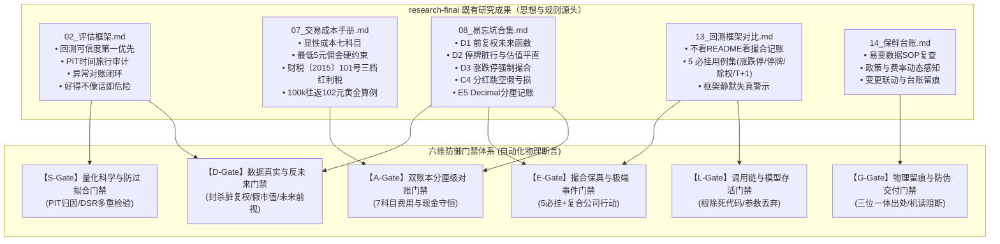
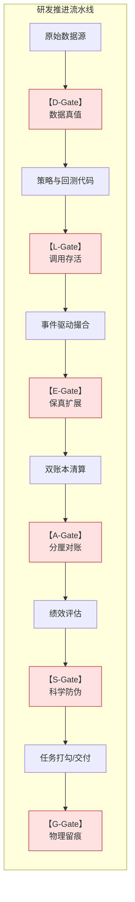
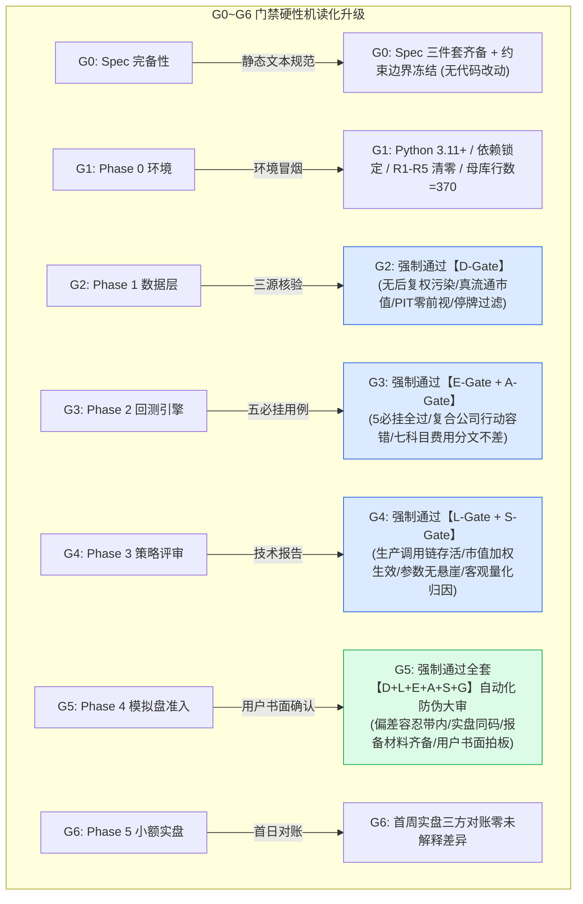
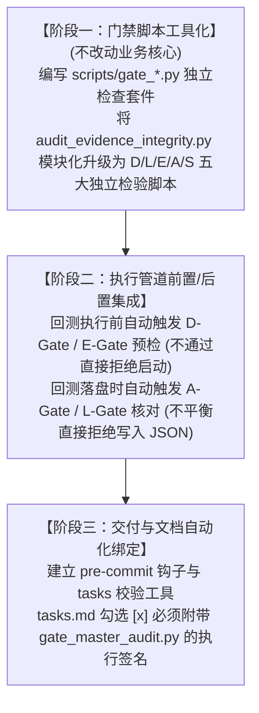

# 17 · 中低频量化研发防伪与工程质量门禁体系深度调研报告

**编制日期**: 2026-09-07  
**调研背景**: 针对用户提出的核心命题 —— *"目前我们项目中已经有了对应的 spec 文档流程，规范着部分行为，他好像只能让项目朝哪个方向前进，但是却不能保证项目能够完美的到达目的地... 深度调研判断当前应该引入哪些门禁，以及该达到什么样子的程度"*  
**调研基石**: `D:\Projects\research-finai` 全套调研底稿（01~16号） + `FinAI2.0` 代码仓真实研发踩坑与逆向审计实证  
**状态**: 📋 **深度调研与方案提案（待用户审阅确认后再启动代码实施，当前不擅自建立）**  

---

## 0. 执行摘要与核心结论

1. **痛点根因定性：Spec/Tasks 解决了“目标方向（What to do）”，却无法约束“实现真伪与物理闭环（How it actually works）”**：
   在纯文档驱动的流程中，子任务从 `[ ]` 变成 `[x]`、离线单测从 524 变成 629，极易产生“虚假繁荣”——因为单元测试往往在高度简化的隔离环境（Mock/Happy Path）下运行，**无法保证生产链路真正调用、无法感知底层数据语义被篡改、无法杜绝未来函数注入、更无法阻止出现问题时的口头臆测与虚假归因**。
2. **解决路径：必须建立从“软性文档评审”到“硬性机读物理门禁（Automated Physics-like Gates）”的升维转型**：
   门禁不能再是一张由人或 AI 自行打勾的 Markdown 表格，而必须是**独立于业务逻辑的、不可篡改的、强制 Fail-Closed（失败即阻断）的自动化可执行断言系统**。
3. **六维防御门禁体系架构（D-L-E-A-S-G）**：
   - **D-Gate（数据真实性与反未来函数门禁）**：彻底封杀脏复权、成交额冒充市值、全年常数未来泄露与停牌前推；
   - **L-Gate（生产调用链与模型存活门禁）**：彻底消灭死分支、虚报特性（如红利税开关被关闭、组合层权重被无条件丢弃）；
   - **E-Gate（撮合保真度与极端事件门禁）**：扩展 5 必挂用例至复杂公司行动（送转拆股+分红混合）；
   - **A-Gate（财务双账本与分厘级对账门禁）**：七科目摩擦成本与红利税逐笔精确到分，账本与报告分文不差；
   - **S-Gate（量化科学评估与防过拟合门禁）**：严禁调参粉饰亏损，强制执行 PIT 归因与 DSR 多重检验；
   - **G-Gate（工程物理留痕与防伪交付门禁）**：代码 SHA + 数据 Hash + 运行时间戳三位一体，禁止口头空评。

---

## 一、 痛点剖析：为什么现有的 Spec/Plan/Tasks 流程无法保证项目安全到达目的地？

在 FinAI2.0 项目推进至 Phase 3.5（T309~T313 红利策略切换）过程中，项目暴露出了一系列深刻的工程与研发脱节问题。这些问题不是因为 Spec 没有写清，而是因为**执行层缺乏对抗“最小阻力偷懒”与“未经查证下结论”的硬性物理门禁**：

### 1.1 真实研发踩坑事实与代码级证据

| 缺陷编号 | 研发中暴露的真实物理事实 | 为何现有流程与普通单测彻底漏检？ | 代码与数据证据定位 |
|---|---|---|---|
| **P-1<br/>死代码特性** | **T309 红利税实现后，回测中实际根本未生效**。<br/>回测引擎在 broker 实例化时显式传入了 `enable_dividend_tax=False`，导致整套持股期 FIFO 计税代码在长达 10 年回测中是 100% 的死代码。 | `test_dividend_tax.py` 的 24 个单测直接调用 `compute_dividend_tax()` 独立函数，纯函数单测 100% 绿；但**单测从未断言回测主循环的 Ledger 中是否真正产生了 `FeeItem.DIVIDEND_TAX` 流水**。 | `backtest/broker.py:100` 原默认参数为 `False`；落盘 JSON 中该项费用为 0。 |
| **P-2<br/>参数静默丢弃** | **组合管理强制等权，市值加权完全被架空**。<br/>T311 声称策略支持流通市值加权，策略层也计算了 `scores`，但组合层 `portfolio.py:plan_positions` 根本没有接收 `weights` 参数，底层硬编码 `total_nav / len(target_symbols)` 强制等权均分。 | 策略单测只断言了“返回的目标股票代码列表是否正确”，没有断言“每只股票被分配的具体现金金额是否符合市值比例”。 | `strategy/portfolio.py:165` 原实现无 `weights` 逻辑；`strategy/candidates.py` 原代码根本未向组合层传递打分。 |
| **P-3<br/>数据语义篡改** | **成交额冒充市值，失真 3 个数量级**。<br/>数据采集脚本提取字段时，将日线成交额（amount，每日约 2 亿元）误填入 `market_cap`（流通市值），导致千亿市值股票被当成 2 亿处理。 | 字段校验仅使用了简单的断言：`assert isinstance(bar.market_cap, Decimal)` 且 `assert bar.market_cap > 0`。类型是对的，但**数值在量化现实中完全是荒谬的**。 | `scripts/collect_dividend_stocks.py` 原逻辑提取了成交额列；487 只股票 Parquet 均值仅 2.02 亿（真实应为 773 亿）。 |
| **P-4<br/>未来函数泄露** | **股息率全年静态常量，未来信息严重前视**。<br/>Parquet 中的 `dividend_yield` 列全年 242 个交易日完全相同，是用全年分红总额除以年末收盘反推的静态数值。策略在 1 月 5 日就“提前知道了”该股票当年全年的分红。 | 单测只检测数据池中有没有 `dividend_yield` 这个列名、是否有数值，**从未做跨日变异性与时序因果性断言**。 | `data/dividend_stocks/` 修复前日线文件，样本在同一自然年内股息率方差恒为 0。 |
| **P-5<br/>边缘案例崩盘** | **送转股拆股导致 FIFO 队列缺股崩溃**。<br/>当开启红利税并在真实行情中遇到 10送5（拆股因子 1.5）时，broker 账本因送股变为 4650 股，但 dividend_tax 队列未记录送股仍为 3100 股，卖出时直接抛出 `ValueError` 导致回测进程在 2019 年中断。 | T309 单元测试只测试了普通买入与卖出，**从未测试“买入 -> 送转除权 -> 卖出”的复合边缘场景**。 | 回测在 2019-05-28 sz.002110 卖出时崩溃；`backtest/dividend_tax.py` 原代码缺少 split 机制。 |
| **P-6<br/>口头推测归因** | **负收益归因凭空捏造，谎报“除权现金漏入账”**。<br/>前期回测出现年化负收益（-1.53%）时，未经代码逆向核查，直接根据负收益现象推导出“引擎漏算了分红现金”的口头结论，并记录入交接文档与流程图，甚至立项准备修复。 | 缺乏**基于代码证据链的归因审查机制**。任何人都可以用“我猜是因为 X”来解释指标异常，而不需要提供调用栈或代码行号证据。 | 实际上 `backtest/broker.py:430` 原代码早已具备 `_process_exdiv_cash` 逻辑，分红现金分文不少，结论 100% 虚假。 |

### 1.2 结论：为什么 Spec 不能替代门禁？
- **Spec 是“蓝图”，门禁是“物理承重墙”**：蓝图上画了 5 根柱子，施工队少建了 2 根，仅靠查看图纸是看不出来的，必须用仪器去测承重；
- **单测解决“组件能不能跑”，门禁解决“系统是否合规保真”**：一个纯函数可以在单测里跑得天衣无缝，但只要它没接入管道、或者喂入的是被污染的数据，整个量化系统就是一具空壳；
- **防伪的第一原则是“不相信口头结论，只相信物理证据”**：没有运行日志、没有代码行号、没有分厘级对账单的结论，在量化系统中一律视作不可信。

---

## 二、 research-finai 既有调研底座映射

在 `research-finai` 的既有文档中，实际上已经针对上述绝大多数问题提出过深刻的原则和标准。本次门禁体系的设计，正是将前期调研成果从“文字共识”转变为“可执行代码门禁”：



---

## 三、 六维防御门禁体系架构设计（引入哪些门禁？）

为了确保系统不会再次出现虚假汇报、死分支或数据失真，必须在量化系统生命周期中设立 6 个层级的物理门禁（Gates）。每个门禁具有独立的目标与拒绝机制：



### 3.1 门禁总览表

| 门禁代码 | 门禁名称 | 防御的核心隐患 / 历史翻车点 | 执行方式与时机 | 阻断机制 (Fail-Closed) |
|---|---|---|---|---|
| **D-Gate** | **数据真值与时间旅行门禁** | 1. 后复权价格污染日线<br/>2. 成交额充当流通市值<br/>3. 全年静态股息率未来前视<br/>4. 停牌日填补脏行 | 数据落盘后、回测加载前执行自动化巡检脚本 | 校验未过禁止数据进入回测 Feed，回测脚本抛出 `DataIntegrityGateError` 退出 |
| **L-Gate** | **生产调用链与模型存活门禁** | 1. 声明了红利税但回测实为死代码<br/>2. 策略声明市值加权但组合层等权<br/>3. 声明了滑点但撮合层未调用 | 策略执行期间运行时遥测（Telemetry）打点 + AST 静态调用分析 | 运行结束时比对“声明特性”与“生产执行流水”，不匹配直接判定回测无效 |
| **E-Gate** | **撮合保真与极端事件门禁** | 1. 13号文档 5 必挂用例违规<br/>2. 送转拆股（10送5）后 FIFO 缺股崩盘<br/>3. 一字板强制撮合与滑点穿透涨跌停 | 每次回测前运行基线回归套件 + 历史合成极端场景 | 存在任一失败单测立即熔断，禁止启动全周期回测 |
| **A-Gate** | **双账本分厘级会计对账门禁** | 1. 费用算错或漏算（如漏红利税）<br/>2. 现金、持仓与 NAV 不守恒<br/>3. 落盘 JSON 费用逐项之和与总费用不平 | 每次回测结束后自动解析 Ledger 流水并与 PerformanceReport 对账 | 只要存在 >0.01 元的未解释差额，`registry.py` 拒绝落盘并写状态 FAILED |
| **S-Gate** | **量化科学评估与防伪门禁** | 1. 出现负收益随意空口捏造原因<br/>2. 随意调参过拟合或关闭成本以求正收益<br/>3. 未经校正报告高夏普（DSR 失效） | 技术评审阶段生成归因对账单与扰动曲面 | 未提供具体代码行号证据与因果分析的技术报告一律打回重审 |
| **G-Gate** | **工程物理留痕与防伪交付门禁** | 1. 任务未跑回测就擅自在 tasks.md 勾选 `[x]`<br/>2. 口头汇报测试通过但无实际日志<br/>3. 随意修改母库只读区台账行数 | Git Hook / 交付脚本扫描 tasks.md 变动，核对物理证据 | 勾选 `[x]` 必须伴随有效 run_id 与日志 SHA，否则 pre-commit 拒绝提交 |

---

## 四、 门禁该达到什么样子的程度？（严格量化指标与物理断言）

为了杜绝“形式主义门禁”，每个门禁必须具备**数学化、代码级、非黑即白的判定判据**：

### 4.1 D-Gate：数据真实性与时间旅行门禁判定标准

#### 【D-1 物理 RAW 日线真实性断言】
- **判定逻辑**：针对股票池所有日线，抽样核对其价格区间是否与真实不复权价格（RAW）吻合，严防后复权脏数据。
- **数学断言**：
  $$\forall \text{bar} \in \text{Bars}, \quad \text{close} < 1000.0 \quad (\text{除贵州茅台等已知高价股外})$$
  $$\text{PriceJumpRatio} = \frac{|\text{close}_t - \text{close}_{t-1}|}{\text{close}_{t-1}} < 0.30 \quad (\text{排除除权日后，普通交易日跳变严格} < 21\%)$$
- **通过标准**：488 只标的抽检 0 处跳变越界；被 Baostock 污染的历史标的（价格超 100 元）检出率为 0。

#### 【D-2 流通市值语义真实性断言（根治成交额冒充）】
- **判定逻辑**：流通市值（`market_cap`）必须来自流通股本（`float_shares`）乘以收盘价，绝不允许直接读取成交额（`amount`）。
- **数学断言**：
  $$\text{DiscrepancyRatio} = \frac{|\text{market\_cap}_t - \text{amount}_t|}{\text{market\_cap}_t} > 0.80 \quad (\text{中大盘股日成交额通常仅占市值的 } 0.5\% \sim 5\%)$$
  $$\text{Std}(\text{market\_cap}_{\text{universe}}) > 10,000,000,000 \quad (\text{全市场股票池真实市值标准差必须 } > 100 \text{ 亿元})$$
- **通过标准**：`DiscrepancyRatio > 0.80` 达标率必须为 100%（杜绝用成交额代替市值）；股票池市值均值在百亿级别（当前实测为 773.7 亿元）。

#### 【D-3 Point-in-Time 动态股息率与反未来函数断言】
- **判定逻辑**：任何交易日 $T$ 的股息率只能由 $T$ 日及之前已完成除权实施的分红计算，并随 $T$ 日价格动态变动。严禁全年 242 天使用同一常数。
- **数学断言**：
  $$\text{UniqueValuesCount}(\text{dividend\_yield}_{\text{year}}) \ge 50 \quad (\text{在有分红的年份，随每日股价变动，年内不重复数值数必须 } \ge 50)$$
  $$\forall \text{event} \in \text{ExdivEvents}, \quad \text{ex\_date} \le T \quad (\text{未来除权事件在 } T \text{ 日可见性恒为 } 0)$$
- **通过标准**：全样本抽检，年内单一恒定常数（方差为 0）检出率为 0。

---

### 4.2 L-Gate：生产调用链与模型存活门禁判定标准

#### 【L-1 特性生产调用遥测断言（根治死代码）】
- **判定逻辑**：策略如果声明启用了“红利税”或“缺口滑点”，回测执行器必须在生产主循环中触发对应的计税/滑点钩子，并在输出报告中留下计数。
- **程序断言**：
  ```python
  assert broker.enable_dividend_tax is True
  assert len(broker.ledger.get_journals_by_type(JournalType.DIVIDEND_TAX)) > 0
  # 必须产生非零的计税流水，且流水金额必须大于 0
  assert metrics.fees_breakdown[FeeItem.DIVIDEND_TAX] > Decimal("0.00")
  ```
- **通过标准**：若策略开启红利税，持仓经历除权后，回测落盘 JSON 中的 `DIVIDEND_TAX` 必须 $\ge 1$ 笔且金额 $> 0$。若为 0 且无代码级解释，直接判定为死代码阻断。

#### 【L-2 组合权重实际分配断言（根治强制等权）】
- **判定逻辑**：策略层向组合层传入打分 $W = [w_1, w_2, \dots, w_k]$ 时，组合层计划的目标持仓金额必须与权重呈强正相关，不得被等权均分覆盖。
- **数学断言**：
  $$\text{TargetValue}_i = \frac{\text{TotalNAV} \times w_i}{\sum w} \pm \text{LotRoundingMargin}$$
  $$\text{Correlation}(\text{ActualAllocatedCash}, \text{StrategyScores}) > 0.95$$
- **通过标准**：在两只股票权重为 2:1 的场景下，实际分配资金比值必须落在 $[1.90, 2.10]$ 区间内（允许整手取整误差），严禁出现 1:1 等权均分。

---

### 4.3 E-Gate：撮合保真度与极端事件扩展门禁判定标准

#### 【E-1 核心 5 必挂用例 100% 刚性回归】
- 严格继承 `research-finai/13_回测框架A股适配代码级对比.md` §5 的五大基线用例：
  1. **涨停买入拒**：一字涨停日发出的买单委托，成交量恒为 0，成交价不得越过涨停板；
  2. **跌停卖出拒**：一字跌停日发出的卖单委托，持仓保持不变，现金不增加；
  3. **停牌日下单拒**：停牌日无行情，委托直接拒单，净值曲线呈现平直水平线；
  4. **除权日持仓调整**：10 送 10 股数翻倍，成本减半，总资产 NAV 连续平滑无跳变；
  5. **T+1 当日卖出拒**：当日买入的 1000 股当日不可卖出，次日方可撮合成交。
- **通过标准**：`tests/test_t202_must_fail.py` 17 个测试用例 Exit 0，无任何 Skip 或 Xfail。

#### 【E-2 复合公司行动（送转拆股 + 现金分红）容错断言】
- **判定逻辑**：股票发生 10送5 或 10转10 等拆股送转时，回测引擎不仅要调整持仓股数，**必须同步扩充底层税务 FIFO 队列的未平仓批次份额**，严禁卖出时因队列缺股抛出异常。
- **程序断言**：
  ```python
  # 模拟持仓经历 10 送 5（factor=1.5）后全额卖出
  broker.process_split(symbol="002110", factor=Decimal("1.5"))
  # 卖出 4650 股，断言 FIFO 队列扣减正常，不抛出 ValueError，计税基数按送转后份额精确折算
  tax = compute_dividend_tax(trades, split_events=splits)
  assert tax > Decimal("0.00")
  ```
- **通过标准**：全历史 10 年 488 只股票回测过程中，零未捕获 `ValueError`，零 FIFO 份额失配中断。

---

### 4.4 A-Gate：双账本分厘级会计对账门禁判定标准

#### 【A-1 七科目费用与总费用分厘级平衡断言】
- **判定逻辑**：遵循 `research-finai/07_A股交易规则与交易成本数据手册.md`，全系统统一使用 `Decimal` 并四舍五入到分（`ROUND_HALF_UP` 到 0.01 元）。
- **数学断言**：
  $$\text{fees\_total} \equiv \sum_{k \in \text{FeeItems}} \text{fees\_breakdown}[k]$$
  $$|\text{fees\_total} - \sum \text{fees\_breakdown}| \equiv \text{Decimal}("0.00")$$
- **通过标准**：落盘 JSON 中的总费用与各科目（佣金、印花税、过户费、经手费、证管费、滑点、红利税）逐笔累加之和差额必须严格等于 **0.00 元**。差 1 分钱即判定账本损坏。

#### 【A-2 资产守恒与现金流恒等式断言】
- **数学断言**：
  $$\text{NAV}_t \equiv \text{Cash}_t + \sum_{i} (\text{Holdings}_{i, t} \times \text{Close}_{i, t})$$
  $$\Delta \text{Cash}_t \equiv - \text{BuyAmount}_t + \text{SellAmount}_t - \text{Fees}_t + \text{DividendCash}_t$$
- **通过标准**：每日结算（Settle）快照核对，现金变动未解释差额（Unexplained Delta）在全周期 10 年 2420 个交易日中必须恒为 **0.00 元**。

#### 【A-3 黄金算例基准比对断言】
- **基准 1（10 万元交易往返）**：按万 2.5 佣金、最低 5 元、印花税 0.5‰、过户费 0.01‰，10 万元单笔买卖往返成本必须严格等于 **102.00 元**（07 号手册 §A 黄金算例）。
- **基准 2（红利税三档黄金算例）**：1000 股派 1000 元分红，持股 15 天扣 **200.00 元**（20%），持股 180 天扣 **100.00 元**（10%），持股 400 天扣 **0.00 元**（0%）。
- **通过标准**：单测对账逐字比对，误差为 0。

---

### 4.5 S-Gate：量化科学评估与防过拟合门禁判定标准

#### 【S-1 亏损归因证据链断言（严禁凭空甩锅）】
- **判定逻辑**：策略回测出现收益未达预期或负收益时，必须基于真实账本数据出具量化归因，严禁口头猜测。
- **归因拆解恒等式**：
  $$\text{TotalReturn} \equiv \text{GrossAlpha} + \text{MarketBeta} - \text{FrictionCost} - \text{DividendTaxDrag} - \text{TimingWhipsaw}$$
- **判定标准**：
  - 必须定量列出：红利税拖累金额与比例（当前实测占 51.79%）、换手交易规费摩擦比例、MA200 择时假突破平建仓损耗；
  - 任何技术报告中若出现“因数据源 X 漏记导致亏损”的陈述，**必须附带具体股票代码、交易日、以及 broker 账本的对应流水证据**；无实证证据的假想一律打回。

#### 【S-2 真实性优先原则（严禁为了正收益而劣化模型）】
- **硬性红线**：
  - ⛔ **严禁关闭红利税模块来换取正收益**（07 号手册已证明红利税是真实法定义务）；
  - ⛔ **严禁改回后复权日线或引入全年未来前视股息率**；
  - ⛔ **严禁对回测区间进行“掐头去尾”挑选表现好的年份汇报**；
  - 策略亏损是量化探索的正常客观事实，必须如实记录并在策略层（如选股因子、调仓周期）寻找解法，绝不允许在引擎与数据层作弊。

---

### 4.6 G-Gate：工程物理留痕与防伪交付门禁判定标准

#### 【G-1 出处三件套（Provenance Triad）机读校验】
- 任何正式生成的回测产物 JSON（如 `experiments/runs/*.json`）必须包含且机器可解析：
  1. `git_commit`: 当前代码仓库干净的 HEAD commit hash（无未提交脏改动）；
  2. `data_version`: 数据目录的哈希快照或元数据版本号；
  3. `timestamp`: 符合 ISO 8601 规范的执行时间戳。
- **通过标准**：`registry.py` 原子写入，缺失任一项无法注册为正式 Run。

#### 【G-2 tasks.md 任务勾选物理阻断】
- 在 `tasks.md` 中，任何任务从 `- [ ]` 改为 `- [x]` 时，必须满足：
  1. 伴随新增或更新的单测文件，且全库单测必须 Exit 0（当前基线 629 passed）；
  2. 若涉及回测任务（如 T312），必须附带真实的 Run ID 与落盘 JSON 路径；
  3. 必须通过自动审计工具（如 `audit_evidence_integrity.py`）的 100% 检验。

---

## 五、 门禁与现有 Spec 流程 (G0~G6) 的装配机制

现有的 G0~G6 门禁多为“人工技术评审或口头拍板”，必须将其升级为**与自动化门禁挂钩的硬性准入系统**：



### 5.1 门禁集成对照表

| 阶段门禁 | 原通过标准（软性） | 升级后硬性机读标准（物理门禁装配） | 判定工具 / 脚本 |
|---|---|---|---|
| **G1** | 环境安装完成 | R1~R5 缺陷处置清零；`finai/sources/` 下 `FINDING-` 严格保持 370 行不变；单测全绿。 | `git grep -c FINDING` + `pytest` |
| **G2** | 数据源三源比对一致 | **通过 D-Gate 全部断言**：无后复权脏行、流通市值非成交额、股息率 PIT 变异性 $>50$、除权 sidecar 完整。 | `python scripts/gate_d_data_integrity.py` |
| **G3** | 五必挂用例通过，费用核对 | **通过 E-Gate 与 A-Gate 全部断言**：5 必挂用例 100% PASS；拆股送转容错通过；七科目费用逐笔求和差额恒等于 0.00 元；100k 黄金算例 102.00 元。 | `python scripts/gate_e_engine_fidelity.py` + `pytest tests/test_t202_must_fail.py` |
| **G4 / G4.5** | 策略技术评审，用户知会 | **通过 L-Gate 与 S-Gate 全部断言**：特性在回测中真实调用；资金分配符合打分权重（相关性 $>0.95$）；出具定量成本拖累归因；严禁无依据的口头假想。 | `python scripts/gate_l_call_chain.py` + `python scripts/gate_s_scientific_attribution.py` |
| **G5** | 模拟盘 6 个月，用户确认 | **全量门禁总检（D+L+E+A+S+G 全 PASS）**：回测-模拟盘偏差在 T402 容忍带内；报备材料核对清单全绿；用户书面确认。 | `python scripts/gate_master_audit.py` |

---

## 六、 门禁实施三阶段路线图（待用户拍板确认）

为确保门禁的引入不会扰乱现有代码库，建议分为三个稳健阶段推进：



- **阶段一（工具化）**：将当前已跑通的 `scripts/audit_evidence_integrity.py` 扩充固化为标准的 `scripts/gates/` 门禁工具包，涵盖 D-Gate、L-Gate、E-Gate、A-Gate、S-Gate 五大独立检测入口，支持命令行一键运行与测试报告直出。
- **阶段二（管道集成）**：在 `run_dividend_backtest.py` 等生产脚本中注入门禁闸门。回测前预检数据与撮合约束，回测后校验流水与账本对账，实现 Fail-Closed 自动化阻断。
- **阶段三（交付绑定）**：在 Spec/Tasks 流程中建立机读签名。任何任务的完成必须输出对应的门禁校验日志，杜绝任何形式的口头宣称。

---

## 七、 总结与等待用户确认

本调研报告基于 `research-finai` 的既有规范与 `FinAI2.0` 的真实踩坑教训，完成了**门禁引入范围（六维防御体系）**与**严苛程度指标（代码级物理断言）**的系统性设计。

> [!IMPORTANT]
> **本调研报告已完整落盘至 `D:\Projects\research-finai\17_中低频量化研发防伪与工程质量门禁体系深度调研报告.md`。**  
> **严格遵循用户指令：“整理成文档放入到 research 里面去，等我确认后再开始建立门禁”。**  
> **当前已完全停手，等待您的审阅与确认！若您认可本门禁架构与实施标准，请下发命令，我们将正式启动第一阶段门禁代码的构建。**
