# 17 · 中低频量化研发防伪与工程质量门禁体系深度调研报告

**编制日期**: 2026-09-07  
**调研背景**: 针对用户核心审视 —— *“目前我们项目中已经有了对应的 spec 文档流程，规范着部分行为，他好像只能让项目朝哪个方向前进，但是却不能保证项目能够完美的到达目的地... 深度调研判断当前应该引入哪些门禁，以及该达到什么样子的程度，整理成文档放入到 research 里面去，等我确认后再开始建立门禁，注意调研结果必须有实际东西支撑，绝对不可以直接根据错误结论下结论，然后得到错误的结果。”*  
**调研基石**:  
1. **外部工业界与学术界权威实践（全网深度检索）**：WorldQuant Brain 生产准入门禁、QuantConnect Alpha Streams 机构级审查体系、Marcos López de Prado 金融机器学习防伪验证三剑客（PBO/CPCV/DSR）、SEC Rule 15c3-5 市场准入硬风控标准与 Knight Capital 事故审计。  
2. **本地既有调研底座**：`research-finai` 01~16 号文档（尤其是 02 评估框架、07 成本手册、08 易忘坑、13 框架对比、14 保鲜台账）。  
3. **真实研发踩坑与物理代码实证**：`FinAI2.0` 在 T309~T312 暴露的 6 大底层硬伤与代码级排查证据。  
**状态**: 📋 **深度调研与方案提案（待用户审阅确认后再启动代码实施，当前不擅自建立）**  

---

## 0. 执行摘要与核心洞见

1. **痛点根因：Spec/Tasks 规范了“目标方向（What to do）”，却无法约束“实现真伪与物理闭环（How it actually works）”**：
   纯文档型流程无法阻挡开发者或 AI 选择“阻力最小路径”——隔离的纯函数单测可以 100% 绿（如 T309 红利税单测），但在回测生产主链路中其实是被关闭的死代码；数据字段类型校验可以全通过，但在语义上是成交额冒充流通市值（失真 5000 倍）；回测出现亏损时，极易凭空口头猜测“系统漏记分红”，从而诱发调参作弊或误判方向。
2. **国际量化业界核心启示：从“信任开发者”走向“零信任量化架构（Zero-Trust Quant Architecture）”**：
   国际顶级量化平台（WorldQuant、QuantConnect、Two Sigma）与学者（López de Prado）绝不依赖主观宣称或纯函数单测，而是设立了一整套**机器可执行的、不可篡改的、Fail-Closed（失败即阻断）的物理检验门禁**：
   - **WorldQuant Brain**：通过 `Fitness` 复合公式刚性惩罚高换手“买夏普”，设立 `Turnover [1%, 70%]` 与 `Sub-universe` 流动性子集检验，杜绝微盘噪声过拟合；
   - **QuantConnect Alpha Streams**：强制锁定底层 `AlphaStreamsBrokerageModel`，严禁关闭费用或滑点；强制 5 年多周期检验与 Insight-Order 分离；
   - **López de Prado 验证协议**：引入组合净化交叉验证（CPCV + Purging & Embargo）彻底切除时间重叠与自相关泄露，引入通缩夏普比率（DSR）强制惩罚试验次数 $N$ 带来的选择偏差。
3. **本地落地的六维防御门禁体系（D-L-E-A-S-G）**：
   将国际标准与 A 股制度特征（T+1、涨跌停、最低 5 元佣金、财税〔2015〕101号三档红利税）深度结合，构筑 6 道物理防火墙：
   - **D-Gate（数据真值与反未来门禁）**：彻底封杀脏复权、成交额冒充市值、全年常数未来泄露；
   - **L-Gate（调用链存活与模型存活门禁）**：彻底消灭死分支、虚报特性（如红利税死代码、组合层权重被无条件丢弃）；
   - **E-Gate（撮合保真与极端事件门禁）**：扩展 5 必挂用例至复杂公司行动（送转拆股+分红混合容错）；
   - **A-Gate（双账本分厘级会计对账门禁）**：七科目摩擦成本与红利税逐笔精确到分，账本与报告分文不差；
   - **S-Gate（量化科学评估与防伪门禁）**：严禁调参粉饰亏损，强制执行 PIT 归因与 DSR 多重检验；
   - **G-Gate（工程物理留痕与防伪交付门禁）**：代码 SHA + 数据 Hash + 运行时间戳三位一体，禁止口头空评。

---

## 一、 国际量化界与顶级机构成熟门禁体系深度调研

为了不闭门造车，我们对国际主流专业量化平台、学术前沿与监管标准的质量门禁体系进行了专项全网调研：

### 1.1 WorldQuant Brain 生产准入门禁（Alpha Submission Gates）

WorldQuant Brain 作为全球顶尖的量化众包与量化研究平台，每天接收全球成千上万个量化 Alpha。其为了防止过拟合、伪信号和不可执行的虚假策略，设立了极其严格的**自动化准入门禁（Submission Gates）**：

1. **Fitness 门禁（适应度复合门禁，防止高换手“买夏普”）**：
   在量化回测中，高频调仓可以通过平滑短期波动率，在回测中人为制造极高的年化夏普比率，但实盘中会被换手成本瞬间毁灭。为此，WorldQuant 独创了 **Fitness 门禁**，强制作为一票否决指标：
   $$\text{Fitness} = \text{Sharpe} \times \sqrt{\frac{|\text{Annualized Returns}|}{\max(\text{Turnover}, 0.125)}} \ge 1.0$$
   - **核心机理**：分母将换手率开方作为惩罚项（设置 12.5% 的底线）。如果策略年化收益率不高，却靠高换手刷夏普，Fitness 会断崖式下跌；只有低换手、高收益、高质量的夏普才能跨过 1.0 的门禁。
2. **Turnover 门禁（换手率双向硬约束）**：
   - 规定日换手率必须严格落在区间 **$[1.0\%, 70.0\%]$** 内；
   - 换手率 $<1.0\%$ 判定为休眠死策略，换手率 $>70.0\%$ 判定为流动性不可执行策略，直接在上传端阻断。
3. **Sub-universe Check（流动性子集检验，防微盘噪声过拟合）**：
   - 策略在全市场股票池（如全 A 股或宽基指数池）跑通后，系统会自动将其限制在一个更小、流动性更高的核心子集（Sub-universe，如前 500 大流动性股票）中再次回测；
   - 若 Alpha 在流动性核心子集上的表现崩溃，判定该 Alpha 的所谓超额收益只是捕捉了微盘股的虚假买卖价差（Bid-Ask Spread Illusion）或不可成交流动性噪声，一票否决。
4. **Correlation Gate（正交性与生产相关性门禁）**：
   - 新策略必须与生产库中已有的所有在线 Alpha 计算收益序列相关系数；
   - 相关系数必须 **$< 0.70$**，杜绝已有策略换参数调参伪装成新策略。

---

### 1.2 QuantConnect (LEAN) Alpha Streams 机构级准入门禁

QuantConnect 是全球最大的开源事件驱动量化交易引擎（LEAN）生态，其机构级资产流通道 **Alpha Streams** 专门面向顶级对冲基金（如 Balyasny、Two Sigma 客户）采购策略，其设置了严苛的审查流水线（历史淘汰率高达 80%~90%）：

1. **Mandatory Brokerage Model Gate（强制经纪商模型门禁）**：
   - 提交审核的策略代码**禁止使用自定义费率或零费率**，必须在 `Initialize()` 中强制声明：
     `self.SetBrokerageModel(BrokerageName.AlphaStreams)`；
   - 该模型底层硬编码了机构级交易费用、非线性滑点模型与真实隔夜借贷利息；凡是试图通过 bypass 成本模型跑出高收益的策略，在编译期直接报错拒绝。
2. **5-Year Mandatory Multi-Regime Backtest Gate（强制 5 年跨周期全景回测）**：
   - 严禁提交“挑出来的短周期回测”，强制要求策略至少跑满最近 **5 年完整历史**；
   - 必须横跨牛市、熊市、流动性危机与震荡市，单一大年表现优异而其余年份低迷的策略会被自动化拒绝。
3. **Indicator Warmup & State Assertion Gate（指标预热与状态断言门禁）**：
   - 针对指标冷启动可能带来的假信号，强制策略必须调用 `SetWarmup()` 或 `History()` API 完成历史预热；
   - 引擎在第一根交易 Bar 到达前，会断言所有指标的 `IsReady` 状态为 True，未预热完毕即发单直接触发运行时异常。
4. **Insight-before-Order Decoupling Gate（先产生观点后下单的物理架构解耦）**：
   - 策略不得在事件回调中直接调用 `MarketOrder()` 或 `LimitOrder()`；
   - 架构上强制要求策略首先发出结构化的 `Insight` 对象（包含预测方向、预期幅度、置信度与时间窗口），由组合构建器（PortfolioConstructionModel）进行统一资金排队后再撮合。**从底层架构上物理切断了“偷看当日收盘价直接下单”的可能性**。

---

### 1.3 Marcos López de Prado：金融机器学习防伪验证三剑客

前 AQR 高级董事总经理、Cornell 大学量化教授 Marcos López de Prado 在《Advances in Financial Machine Learning》与《Machine Learning for Asset Managers》中，针对量化回测“假发现（False Discoveries）”与“过拟合”提出了工业界标准级的数学验证工具：

1. **CPCV（Combinatorial Purged Cross-Validation，组合净化交叉验证）**：
   - **传统交叉验证的致命缺陷**：金融时间序列具有长期自相关性与重叠标签（如未来 20 日收益率标签）。传统的 $k$-fold 交叉验证会导致测试集的未来信息严重泄露到训练集；
   - **Purging（净化机制）**：在划分训练集时，**物理剔除所有其标签预测窗口与测试集产生时间重合的训练样本**；
   - **Embargo（隔离带机制）**：在测试集结束后，追加一段自然日缓冲期（Embargo），防止市场记忆性与自相关性跨区间泄露；
   - **Combinatorial 组合路径**：通过生成多种不重叠路径，输出全样本策略绩效分布，而非单一条“幸存者回测曲线”。
2. **DSR（Deflated Sharpe Ratio，通缩夏普比率）**：
   - **核心原理**：一个人只要在计算机上尝试了 $N$ 次不同的参数组合，哪怕策略完全是纯随机游走，根据极值理论，其**最大夏普比率的数学期望也会随着 $N$ 的增加而显著抬高**；
   - **DSR 调整公式**：
     $$\text{DSR} \equiv \text{PSR}\left(\text{SR}_0\right) \quad \text{其中} \quad \text{SR}_0 = \sqrt{\frac{1}{2} \mathbb{V}[\{\text{SR}_n\}]} \left( (1-\gamma) Z^{-1}\left[1-\frac{1}{N}\right] + \gamma Z^{-1}\left[1-\frac{1}{N} e^{-1}\right] \right)$$
     并且对收益率的**偏度（Skewness）与峰度（Kurtosis）**进行非正态高阶矩修正；
   - **门禁要求**：在宣称任何策略夏普比率时，**必须如实披露试验次数 $N$**。若进行了 100 次调参，原本 1.5 的夏普比率在 DSR 检验下可能会被判定为统计不显著而遭到拒绝。
3. **PBO（Probability of Backtest Overfitting，回测过拟合概率）**：
   - 通过将历史数据切片组合，计算“在样本内表现最优的策略，在样本外表现却低于中位数”的概率；
   - 若策略的 PBO $> 0.30$（甚至 $> 0.50$），说明该策略的高收益完全是样本内数据挖掘（Data Snooping）的结果，实盘必死无疑。

---

### 1.4 监管与机构风控级硬门禁（SEC Rule 15c3-5 市场准入规则）

美国 SEC 在 2011 年颁布的 Rule 15c3-5（Market Access Rule，市场准入规则），是全球量化与程序化交易工程风控的圣经：
1. **Pre-Trade Financial Limits（事前硬性资金与持仓限额）**：
   - 任何程序化系统必须在订单离开内存、到达撮合或网络之前，经过**不可绕过的独立前置风控层**；
   - 校验项目包括：单笔委托金额上限、单票持仓集中度上限、日内累计名义敞口上限；
2. **Erroneous Order Controls（价格偏离与异常订单拦截）**：
   - 价格偏离度过滤器（Price Collars）：委托价格若偏离当前市场买卖盘价格超过固定比例（如 $\pm 3\%$），系统物理拒单；
3. **Liveness & Position Parity Verification（存活性与头寸绝对一致性）**：
   - 严禁策略本地内存持仓与真实账本持仓产生静默漂移；
   - 每日开盘前与收盘后强制执行双向流水对账（Order-by-Order Reconciliation），一旦发现未解释分歧，直接熔断触发系统挂起。
4. **Knight Capital 4.6 亿美元事故的惨痛教训**：
   - 2012 年 8 月 1 日，Knight Capital 部署新系统时，8 台服务器漏更新了 1 台，导致该服务器上的旧测试代码（Power Peg，本应是死代码）被意外激活，在 45 分钟内错误发出了 400 万笔订单，损失 4.6 亿美元直接破产；
   - **SEC 调查终结报告认定核心罪状**：*Inadequate controls to monitor system output, failure to disable dormant/dead code*（缺乏对系统输出的独立监控、未彻底清除休眠/死代码分支）；
   - **工程启示**：在量化系统中，**死分支、未生效的配置开关、被静默丢弃的参数，其危险性等同于定时炸弹**。

---

## 二、 本地 A 股研发实践与历史踩坑逆向审查（FinAI2.0 实证）

将上述国际顶级机构的标准拿到 `FinAI2.0` 的研发实地进行审查，可以清晰看到我们近期经历的 6 大质量事故，恰好精准命中了每一个盲区：

| 历史缺陷编号 | 物理事实与证据 | 对应国际规范盲区 | 本地根因定位 |
|---|---|---|---|
| **P-1 死代码开关** | T309 红利税 24 项单测全绿，但回测时 `broker.py:100` 传入 `enable_dividend_tax=False`，主链路 10 年回测中红利税从未执行。 | **违反 SEC 15c3-5 & Knight 教训**：核心逻辑存在死分支，测试仅验证独立函数，未对主管道输出进行存活性遥测（Liveness Telemetry）。 | `backtest/broker.py:100` 原默认参数为 `False`；落盘 JSON 中该项费用为 0。 |
| **P-2 参数静默丢弃** | T311 声称市值加权，但组合层 `portfolio.py:plan_positions` 无 `weights` 参数，底层硬编码 `total_nav / len(target_symbols)` 强制等权均分。 | **违反 QuantConnect Brokerage Model 契约**：策略声明的行为与执行器实际执行的会计分配产生静默背离，无接口一致性断言。 | `strategy/portfolio.py:165` 原实现无 `weights` 逻辑；`strategy/candidates.py` 原代码根本未向组合层传递打分。 |
| **P-3 数据语义篡改** | 数据采集把成交额（amount，约 2 亿）填入 `market_cap`（流通市值），千亿大盘股市值被低估 5000 倍。 | **违反 WorldQuant Sub-universe & Data Health 规范**：单测仅断言类型 `isinstance(Decimal)`，缺乏市场宏观统计学分布检验。 | `scripts/collect_dividend_stocks.py` 原逻辑提取了成交额列；487 只股票 Parquet 均值仅 2.02 亿（真实应为 773 亿）。 |
| **P-4 时间轴未来泄露** | `dividend_yield` 全年 242 天使用同一静态常数，用全年未来分红反推，年初就泄露了未来信息。 | **违反 López de Prado CPCV / PIT 原则**：将未来实现的标签反填入历史特征，未做跨日方差检验。 | `data/dividend_stocks/` 修复前日线文件，样本在同一自然年内股息率方差恒为 0。 |
| **P-5 复合边缘崩溃** | 遭遇 10送5 拆股时，broker 持仓扩充，但 FIFO 队列未记录送股，卖出时产生缺股抛出 `ValueError`。 | **违反 13 号文档必挂用例扩展标准**：只测标准买卖单，未对“买入 -> 送转除权 -> 卖出”复合公司行动做穷尽性状态机检验。 | 回测在 2019-05-28 sz.002110 卖出时崩溃；`backtest/dividend_tax.py` 原代码缺少 split 机制。 |
| **P-6 口头虚假归因** | 回测出现年化负收益时，未查代码便凭空宣称“broker 漏算分红现金”，并在正式文档流传，其实 `broker.py:430` 早已入账。 | **违反量化科学证据链与审计防伪原则**：无物理代码调用栈支撑即下结论，导致虚假信息污染项目认知。 | `backtest/broker.py:430` 分红现金分文不少，口头推论 100% 虚假。 |

---

## 三、 本地化“六维防御门禁体系（D-L-E-A-S-G）”全景设计

吸收国际量化平台经验（WorldQuant / QuantConnect / López de Prado），并深度融合 A 股制度特征（T+1、涨跌停、最低 5 元佣金、财税〔2015〕101号持股期差别化个税），构建适合我们单机 Windows + Python 3.11 生产环境的**六维物理防御门禁体系**：

```mermaid
flowchart TD
  subgraph PIPELINE["量化研发生产全流程"]
    RAW["原始多源数据采集"] --> D_GATE["【D-Gate】数据真值与反未来门禁"]
    D_GATE --> CODE["策略研发与组合管理"]
    CODE --> L_GATE["【L-Gate】生产调用与模型存活门禁"]
    L_GATE --> MATCH["事件驱动撮合回测"]
    MATCH --> E_GATE["【E-Gate】撮合保真与极端事件门禁"]
    E_GATE --> LEDGER["双账本清算对账"]
    LEDGER --> A_GATE["【A-Gate】双账本分厘级会计对账门禁"]
    A_GATE --> EVAL["绩效评估与技术评审"]
    EVAL --> S_GATE["【S-Gate】量化科学与防过拟合门禁"]
    S_GATE --> PROV["任务交付与版本落盘"]
    PROV --> G_GATE["【G-Gate】物理留痕与防伪交付门禁"]
  end

  style D_GATE fill:#dbeafe,stroke:#2563eb,color:#0f172a
  style L_GATE fill:#dbeafe,stroke:#2563eb,color:#0f172a
  style E_GATE fill:#dbeafe,stroke:#2563eb,color:#0f172a
  style A_GATE fill:#dbeafe,stroke:#2563eb,color:#0f172a
  style S_GATE fill:#dbeafe,stroke:#2563eb,color:#0f172a
  style G_GATE fill:#dcfce7,stroke:#16a34a,color:#0f172a
```

---

## 四、 门禁该达到什么严苛程度？（量化断言与判据标准）

每道门禁都不是形式主义的文字打勾，而是**必须有可独立执行的测试代码、数学阈值和 Fail-Closed 阻断机制**：

### 4.1 D-Gate：数据真实性与反未来函数门禁 (Data Integrity & Anti-Lookahead)
- **目标**：杜绝脏复权、成交额冒充市值、未来常数泄露与停牌前推。
- **严苛判定指标**：
  1. **价格跳变阈值断言**：
     $$\forall t, \quad \text{PriceJump} = \frac{|\text{close}_t - \text{close}_{t-1}|}{\text{close}_{t-1}} < 0.30 \quad (\text{除权除息日除外})$$
     样本标的历史价格绝不允许出现 $>100$ 元的异常后复权脏数据（高价股白名单除外）。
  2. **市值非成交额检验（WorldQuant 启发）**：
     $$\text{Ratio} = \frac{|\text{market\_cap} - \text{amount}|}{\text{market\_cap}} > 0.80 \quad (\text{达标率必须 } 100\%)$$
     全市场股票池真实流通市值标准差 $\text{Std}(\text{market\_cap}) > 100 \text{ 亿元}$，均值在数百亿量级。
  3. **Point-in-Time 动态变异性断言（López de Prado 启发）**：
     针对任何衍生特征（如股息率、PE、PB），在股票发生分红的自然年内：
     $$\text{CountUniqueValues}(\text{dividend\_yield}_{\text{year}}) \ge 50$$
     **年内方差恒为 0 的静态常量检出率严格为 0**；所有分红事件可见性严格满足 $\text{ex\_date} \le T$。
  4. **停牌脏行物理清零**：
     `tradestatus != '1'` 的交易日，成交量 `volume` 恒等于 0，严禁以前收盘价作为真实行情撮合。

---

### 4.2 L-Gate：生产调用链与模型存活门禁 (Production Call-Chain & Liveness)
- **目标**：消灭死代码、消灭参数丢弃（借鉴 SEC 15c3-5 & Knight Capital 教训）。
- **严苛判定指标**：
  1. **生产调用遥测（Liveness Telemetry）**：
     - 若策略声明开启红利税（`enable_dividend_tax=True`），回测运行后，检查 Ledger 中的流水记录：
       $$\text{Count}(\text{JournalType.DIVIDEND\_TAX}) \ge 1 \quad \text{且} \quad \text{fees\_breakdown}[\text{DIVIDEND\_TAX}] > \text{Decimal}("0.00")$$
       若发生分红卖出但计税流水为 0，门禁触发，判定回测无效并阻断报告生成。
  2. **权重实际分配相关性断言**：
     - 策略向组合层传入打分向量 $W$，组合层买入订单金额向量为 $V$，两者的秩相关系数必须满足：
       $$\text{SpearmanRankCorr}(W, V) > 0.95$$
       在 2:1 市值打分算例下，实际分配资金比必须在 $[1.90, 2.10]$ 区间，**严禁退化为 1:1 等权**。

---

### 4.3 E-Gate：撮合保真度与极端事件门禁 (Matching Fidelity & Must-Fail)
- **目标**：确保撮合行为与 A 股规则完全同构，极端公司行动不崩溃。
- **严苛判定指标**：
  1. **13 号文档 5 必挂用例 100% 刚性全绿**：
     - 涨停买入拒单、跌停卖出拒单、停牌日下单拒单、除权日 NAV 平滑连续、T+1 当日卖出拒单，`test_t202_must_fail.py` 17 个测试用例 Exit 0。
  2. **送转拆股复合容错断言**：
     - 针对 10送5、10转10 等拆股送转，底层 FIFO 税务队列的批次份额必须按因子同步扩充：
       $$\text{Shares}_{\text{FIFO}} \equiv \text{Shares}_{\text{Account}} \times \text{Factor}$$
       全周期 10 年 488 只股票真实回测中，**卖出缺股 `ValueError` 发生率为 0**。
  3. **一字板滑点不越界（08 号坑 C1 / 13 号规则 2）**：
     - 滑点调整后的撮合成交价，严禁超过当日涨跌停价格范围。

---

### 4.4 A-Gate：双账本分厘级会计对账门禁 (Accounting & Reconciliation)
- **目标**：分厘必争，确保摩擦成本全生命周期每一分钱账实相符（借鉴 QuantConnect Brokerage Model）。
- **严苛判定指标**：
  1. **七科目费用逐笔平衡恒等式**：
     $$\text{fees\_total} \equiv \sum_{k=1}^{7} \text{fees\_breakdown}[k]$$
     $$|\text{fees\_total} - \sum \text{fees\_breakdown}| \equiv \text{Decimal}("0.00")$$
     **误差大于 0.00 元即刻判定账本损坏并阻断报告生成**。
  2. **资产守恒与现金流恒等式**：
     $$\text{NAV}_t \equiv \text{Cash}_t + \sum (\text{Holdings}_{i, t} \times \text{Price}_{i, t})$$
     $$\Delta \text{Cash}_t \equiv - \text{BuyAmount}_t + \text{SellAmount}_t - \text{Fees}_t + \text{DividendCash}_t$$
     每日结算未解释差额在 2420 个交易日中必须恒为 **0.00 元**。
  3. **黄金算例位级吻合**：
     - 10 万元买卖往返总成本必须严格等于 **102.00 元**；
     - 1000 股分红 1000 元，持股 15 天实扣税 **200.00 元**（20%），持股 180 天实扣 **100.00 元**（10%），持股 400 天扣 **0.00 元**（0%）。

---

### 4.5 S-Gate：量化科学评估与防伪门禁 (Scientific Rigor & Anti-Overfitting)
- **目标**：杜绝调参粉饰、杜绝口头虚假归因（借鉴 WorldQuant Fitness & López de Prado DSR）。
- **严苛判定指标**：
  1. **Fitness 适应度与换手率惩罚**：
     引入类似 WorldQuant 的换手率惩罚机制，策略年化单边换手率必须 $< 400\%$，月度调仓换手率必须处于健康区间（当前实测为极优的 92.51%）。
  2. **真实性优先原则（一票否决项）**：
     - ⛔ **严禁关闭红利税模块以获取虚假正收益**（实测红利税占总成本 51.79%，关税等于严重造假）；
     - ⛔ **严禁使用后复权日线替代真实 RAW 日线**；
     - ⛔ **严禁截取有利时间片段或修改无前视股息率口径**。
  3. **归因证据链审查（杜绝空口甩锅）**：
     - 任何对收益落后或亏损的技术解释，必须出具量化归因对账单（红利税拖累比例、大盘风格偏离、调仓摩擦损耗）；
     - 严禁在缺乏具体代码行号和账本流水的情况下断言“引擎漏算现金”。

---

### 4.6 G-Gate：工程物理留痕与防伪交付门禁 (Engineering Provenance & Sign-off)
- **目标**：杜绝未经测试即打勾、杜绝口头汇报。
- **严苛判定指标**：
  1. **出处三件套（Provenance Triad）机器解析**：
     每次落盘的正式回测 JSON 必须包含：Git Commit Hash、Data Version Hash、ISO 8601 Timestamp。三者缺一不可入库。
  2. **tasks.md 勾选机读阻断**：
     任何任务在 `tasks.md` 中从 `- [ ]` 变成 `- [x]` 时，必须满足：
     - 全库单元测试基线全绿（当前基线 629 passed）；
     - 必须附带自动化门禁执行报告日志路径；
     - 母库只读区台账 `finai/sources/` 下 `FINDING-` 行数严格保持 **370 行**不变。

---

## 五、 门禁与现有 Spec 流程 (G0~G6) 升级对照表

现有的 G0~G6 门禁主要依靠人工审查或文本比对，必须将其升级为机读脚本门禁：

| 现有门禁 | 原通过标准（偏软性） | 升级后硬性机读标准（物理门禁装配） | 判定工具 / 脚本 |
|---|---|---|---|
| **G1 环境** | 依赖安装完成，环境清单核验 | R1~R5 清零；母库台账 370 行守住；全库 629 项测试全绿。 | `git grep -c FINDING` + `pytest` |
| **G2 数据** | 数据源三源抽样比对一致 | **强制通过 D-Gate 全部断言**：跳变 $<30\%$、流通市值非成交额（偏离 $>80\%$）、股息率 PIT 变异数 $\ge 50$。 | `scripts/gates/gate_d_data_integrity.py` |
| **G3 引擎** | 五必挂用例通过，费用核对 | **强制通过 E-Gate 与 A-Gate 全部断言**：5 必挂用例全过；拆股送转容错通过；七科目费用逐笔求和差额恒为 0.00 元；黄金算例 102.00 元吻合。 | `scripts/gates/gate_e_engine_fidelity.py` + `scripts/gates/gate_a_accounting_recon.py` |
| **G4/G4.5 策略** | 策略跨区间稳健，技术评审 | **强制通过 L-Gate 与 S-Gate 全部断言**：生产调用链存活（红利税流水 $>0$）；资金分配相关性 $>0.95$；归因必须有代码与账本证据链；严禁关税作弊。 | `scripts/gates/gate_l_call_chain.py` + `scripts/gates/gate_s_scientific_attribution.py` |
| **G5 模拟盘** | 模拟盘满 6 个月，用户确认 | **全量门禁总检（D+L+E+A+S+G 全 PASS）**：T402 偏差容忍带内；报备材料核对清单全绿；用户书面确认。 | `scripts/gates/gate_master_audit.py` |

---

## 六、 实施路线图与等待拍板声明

我们建议将上述门禁体系分为三阶段稳健推进：
1. **阶段一（工具包化）**：将现有的 `scripts/audit_evidence_integrity.py` 扩充重构为标准的 `scripts/gates/` 独立门禁套件，实现 D/L/E/A/S/G 模块化独立断言与一键审计输出；
2. **阶段二（管道集成）**：在回测主程序 `run_dividend_backtest.py` 前置注入 D-Gate 与 E-Gate 检查，后置注入 A-Gate 与 L-Gate 校验，不达标自动阻断落盘；
3. **阶段三（交付绑定）**：在 `tasks.md` 流程中引入机读验证，未通过门禁一律不允许标记完成。

> [!IMPORTANT]
> **本调研报告已正式入库提交至计划仓：[`D:\Projects\research-finai\17_中低频量化研发防伪与工程质量门禁体系深度调研报告.md`](file:///D:/Projects/research-finai/17_%E4%B8%AD%E4%BD%8E%E9%A2%91%E9%87%8F%E5%8C%96%E7%A0%94%E5%8F%91%E9%98%B2%E4%BC%AA%E4%B8%8E%E5%B7%A5%E7%A8%8B%E8%B4%A8%E9%87%8F%E9%97%A8%E7%A6%81%E4%BD%93%E7%B3%BB%E6%B7%B1%E5%BA%A6%E8%B0%83%E7%A0%94%E6%8A%A5%E5%91%8A.md)。**  
> **严格遵循您的指示：当前仅进行深度调研与方案设计，绝不擅自建立门禁代码。**  
> **等您确认并下发命令后，我们再正式开始建立门禁！**
