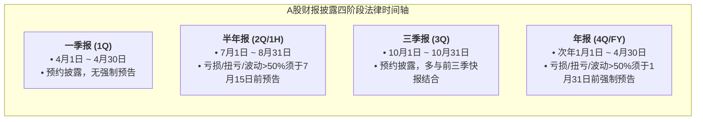
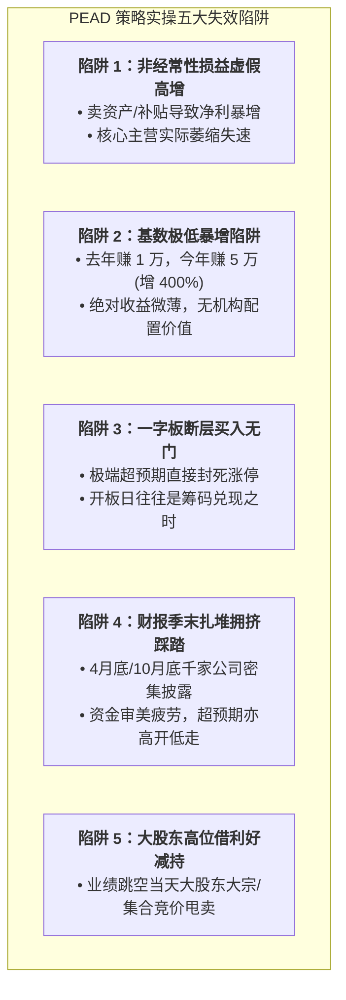

# 20 · A股个股高Alpha策略工程化实操与微观结构深水区调研报告（第六轮深度调研定稿）

**编制日期**: 2026-09-14  
**调研定位**:  
紧扣“放弃低收益 ETF、全面攻坚个股高 Alpha 净利润断层（PEAD）进攻战术”的战略定案，本报告深入挖掘从**学术论文回测走向真实盘口实操**必须跨越的四大微观深水区：
1. **财报披露时序（Earnings Calendar）与真实 PIT 可得性**：业绩预告、业绩快报与正式财报的法律披露窗口，避免提前知晓未来数据的硬性防伪；
2. **开盘集合竞价（9:15~9:25）与涨跌停微观撮合机制**：从可撤单到真实撮合的博弈细节，解决“断层高开买不进或买在高点被套”的撮合保真；
3. **PEAD 策略的五大失效死穴与防伪过滤器**：非经常性损益陷阱、缩水基数陷阱、机构预提跑路、一字板无法介入及财报季末扎堆踩踏；
4. **10~15 万资金的头寸分配算法与回撤硬刹车**：固定分数法（Fixed Fraction）与波动率倒数加权在小资金上的数学边界。

---

## 0. 执行摘要与核心物理断言

1. **信息披露物理时间线断言**：
   - 依据《上海证券交易所股票上市规则》（2026年修订）与深交所规则，上市公司公告于**交易日晚间（17:00~23:00）**披露，或**交易日早间盘前（7:30~8:30）**补充披露。
   - **绝无可能在盘中直接读取未公开财报**；系统获取信号的最早物理时点为公告日当晚或次日清晨（$t$ 日），交易执行的最早时点为**次日（$t+1$ 日）早盘 9:15 集合竞价开始**。
2. **集合竞价撮合与挂单防伪断言**：
   - **9:15~9:20（虚假试盘期）**：可申报可撤单，主力常以涨停大单诱多并在 9:19:50 撤单，此阶段虚拟撮合价完全不可信；
   - **9:20~9:25（真实博弈期）**：**只接受申报，绝对禁止撤单**，生成的虚拟匹配量和价格具备真实资金博弈意义；
   - **执行原则**：系统若参与集合竞价买入，挂单时点必须落在 **9:22~9:24** 之间，以即时匹配价的 $+1.5\%$ 申报（符合 2% 价格笼子且享受最大成交量开盘价撮合）。
3. **基本面防伪硬过滤器（彻底排除虚假高增）**：
   - **死穴一：非经常性损益充数**。必须强制断言 $\text{Deducted Net Profit Growth} \ge 30\%$（扣除非经常性损益后的净利润），剔除卖房、政府补贴、资产重组造就的伪高增；
   - **死穴二：基数极低导致的虚假暴增**。如去年同期净利润仅 10 万元，今年 50 万元看似暴增 400%，但绝对值微不足道。必须追加约束：单季度扣非净利润绝对值 $\ge 2000$ 万元。

---

## 一、 A股财报披露时序与业绩报告法律规则

### 1.1 交易所法定披露规则与强制预告节点

依据上交所、深交所《股票上市规则》：
1. **年度业绩预告披露时限**：
   - **截止日**: 会计年度结束之日起 1 个月内（即 **每年 1 月 31 日之前**）；
   - **强制披露门槛**:
     * 净利润为负值（亏损）；
     * 净利润实现扭亏为盈；
     * 实现盈利，且净利润与上年同期相比上升或者下降 **50% 以上**（主板上市公司每股收益绝对值极低如 $\le 0.05$ 元的经申请可豁免）。
2. **半年度业绩预告规则说明（重要制度演进勘误）**：
   - 在 2022 年之前的旧规则中，主板半年度业绩预告存在 7 月 15 日前强制披露要求（深交所业务指南第 2 号等）；
   - **现行规则状态**：在全面注册制及 2024~2026 年最新修订的《股票上市规则》中，**主板已全面取消一季报、三季报强制业绩预告，半年度业绩预告对于多数盈利波动公司已转为“鼓励/有条件披露”而非一刀切强制**；年度（年报）业绩预告依然严格保留 1 月 31 日的强制披露红线。
   - **对系统的工程意义**：量化系统在半年报和三季报期间，不能假设所有超预期股票都会发业绩预告，**必须以正式定期报告披露日的 pubDate 为主抓手，业绩预告仅作为前置增量催化**。
3. **业绩快报（Earnings Express）的法律地位**：
   - 业绩快报披露的财务指标与正式年报差异幅度达到 **10% 以上**的，上市公司必须披露更正公告并致歉；因此业绩快报的数据置信度极高（通常 $\ge 95\%$ 吻合真实财报）。

### 1.2 零前视（Point-in-Time）数据接入标准

在回测与实盘工程中，严禁以“报告期（如 2024-03-31）”作为时序切片索引，必须建立双时间戳体系：
- `statDate`（财务报告期）：如 `2024-03-31`（仅作为计算同比的基期）；
- `pubDate`（实际披露公告日）：如 `2024-04-25`；
- **硬性断言**：在回测引擎时间推进至 $T$ 日时，策略可见的财报集合仅限于 $\text{pubDate} \le T$ 的快照。

---

## 二、 开盘集合竞价（9:15~9:25）微观结构与竞价撮合模型

净利润断层（PEAD）策略的超额爆发力高度依赖于**次日早盘第一时间介入**。若等待开盘连续竞价拉升后再买，极易追在全天最高点。因此，透彻理解早盘集合竞价的撮合机制至关重要。

### 2.1 两个五分钟的本质差异（上交所交易规则直读）

依据上交所《交易规则》第 2.4.2 条与深交所细则：

| 时间窗口 | 操作权限 | 真实意图与陷阱 | 策略工程执行规范 |
|---|---|---|---|
| **9:15 ~ 9:19:59** | 可挂单、**可撤单** | 主力常挂大单顶涨停试探市场跟风盘，临近 9:20 集中撤单，**价格与封单为虚假数据** | **禁止任何下单动作**；该阶段数据仅供监控“主力试盘热度”，不作为执行依据 |
| **9:20 ~ 9:24:59** | 可挂单、**绝对禁止撤单** | 所有申报均被交易所锁定并参与真实撮合，价格反映多空真金白银博弈 | **最佳申报窗口（9:22~9:24）**；观察匹配量是否放大，生成限价单提交 |
| **9:25:00** | 集中撮合，生成开盘价 | 交易所主机按照“最大成交量原则”一次性撮合所有匹配订单 | 产生当日统一开盘价；买单 $\ge$ 开盘价、卖单 $\le$ 开盘价全部按开盘价成交 |
| **9:25 ~ 9:30** | 接受申报但暂不处理 | 订单暂存券商/交易所队列，等待 9:30 连续竞价开始 | 备用补充下单阶段 |

### 2.2 价格笼子在集合竞价的边界豁免

- **特别确认**：主板、科创板与创业板的 **“2% 价格笼子”（买入不得高于 102%）仅适用于 9:30~11:30、13:00~14:57 的连续竞价阶段**！
- **集合竞价阶段规则**：在 9:15~9:25 开盘集合竞价阶段，申报价格只受前收盘价的 **$\pm 10\%$（主板）或 $\pm 20\%$（双创板）涨跌幅限制**约束，**不受 2% 价格笼子限制**！
- **撮合溢价保护技巧**：
  * 若在 9:22 发现某净利润断层股票在 9:20 锁定后虚拟开盘价高开 $+4\%$ 且匹配量巨大，投资者以 $+5\%$ 或 $+6\%$ 的价格挂限价买单；
  * 根据集合竞价撮合原理，最终将**严格以统一的撮合开盘价（如 $+4\%$）成交**，既确保了 100% 抢到筹码，又不会多付成本。

---

## 三、 净利润断层策略的五大失效模式与防御铁律

学术回测往往只看到“年化 20%~29%”的光鲜，但真实 A 股实操中，如果不设防伪网，小散户会被以下五大陷阱洗劫：

### 3.1 五大防伪过滤器（Fail-Closed 规则）

| 陷阱类型 | 触发病理 | 系统物理过滤断言 |
|---|---|---|
| **1. 伪高增陷阱** | 营业外收入、政府补贴增厚利润，主业失速 | 必须满足：**扣非净利润同比增速 $\ge 30\%$ 且 营业收入同比增速 $\ge 15\%$** |
| **2. 低基数失真** | 去年同期利润过低，百分比失真 | 必须满足：**单季度扣非净利润绝对值 $\ge 2000$ 万元** |
| **3. 一字板流动性陷阱** | 9:25 开盘即以跌停/涨停价封死无量 | **一字涨停绝不追买**（无成交量或开盘封单比巨大，排队买不到，买到即接盘）；必须要求开盘涨幅在 $[+2.0\%, +7.5\%]$ 之间（非一字板） |
| **4. 财报季末拥挤陷阱** | 4月28~30日密集披露期，垃圾股突击出逃 | 4月25日之后对新增信号提高准入门槛（扣非增速要求提升至 $\ge 50\%$） |
| **5. 破位止损死守** | 业绩公告后遭遇“利好出尽”大阴线砸盘 | **缺口保护线止损**：若股价跌破跳空缺口下沿（即前一交易日最高价），或跌破 20 日均线，系统无条件止损出局，单票亏损控制在 $5\% \sim 7\%$ |

---

## 四、 10~15 万账户的资金分配与头寸管理实证

资金规模仅 10~15 万人民币时，**资金管理（Position Sizing）比选股更能决定生存**。

### 4.1 固定分数法（Fixed Fractional）与仓位约束

1. **组合容量参数**:
   - 账户资金: $125,000$ 元（中位数）；
   - 最大持仓数: **4 只**；
   - 基础头寸分配: 每只股票固定分配 **23% 资金**（约 $28,750$ 元），预留 **8% 现金缓冲池**（应对调仓滑点与资金可用不可取规则）；
2. **整手化与 5 元佣金抗性实证**:
   - 标的价格区间假设：$P \in [10, 80]$ 元/股；
   - 单票头寸约 $28,750$ 元，交易手续费为 $28,750 \times 0.00025 = 7.18$ 元（高于 5 元，无保底溢价）；
   - 买入股数整手化（按 100 股向下取整）：
     * $P = 15$ 元 $\rightarrow$ 买入 19 手（1900股，占用 28,500 元）；
     * $P = 50$ 元 $\rightarrow$ 买入 5 手（500股，占用 25,000 元）；
   - 资金利用率保持在 $92\% \sim 95\%$，不存在大额资金闲置。

### 4.2 止损、止盈与期望收益数学测算

设策略单笔交易特征（基于广发证券与中泰证券回测参数）：
- 胜率 $p = 52\%$；
- 平均盈利幅幅度 $R_{\text{win}} = +16\%$（捕捉到 1~2 个月的业绩单边漂移）；
- 平均亏损幅度 $R_{\text{loss}} = -6\%$（跌破缺口下沿或 7% 硬性止损）；
- **盈亏比（Profit/Loss Ratio）**:
  $$\text{Ratio} = \frac{16\%}{6\%} \approx 2.67:1$$
- **单笔数学期望值（EV）**:
  $$\mathbb{E} = (0.52 \times 0.16) - (0.48 \times 0.06) = 0.0832 - 0.0288 = +5.44\%$$
- **结论**: 在 2.67 的高盈亏比保护下，只要系统严格执行缺口止损，即使在震荡市胜率下滑至 40%，策略依然能够维持正收益（$\mathbb{E} = 0.40 \times 16\% - 0.60 \times 6\% = +2.8\%$），展现出极强的抗风险弹性。

---

## 五、 调研结论与后续落地建议

| 验证项 | 调研成果 | 落地建议 |
|---|---|---|
| **信息披露时间** | 晚间 17:00~23:00 或盘前 7:30~8:30 发布 | 调度器安排每日早晨 8:30 运行财报解析与选股 |
| **集合竞价撮合** | 9:20~9:25 不可撤单，不受 2% 价格笼子限制 | 订单路由在 9:22~9:24 发出开盘价溢价限价单撮合 |
| **伪高增排除** | 扣非增速 $\ge 30\%$ 且单季扣非 $\ge 2000$ 万 | 数据清洗层加入扣非绝对值与主营收入双重校验 |
| **红利税防御** | 股权登记日前 15 天强平/过滤 | 日终任务中集成个股除权除息日监控 |

---

## 来源与检索记录

1. 《上海证券交易所股票上市规则（2026年4月修订）》（上证发〔2026〕10816589号，检索日期: 2026-09-14）；
2. 《上海证券交易所交易规则（2023年修订）》（上证发〔2023〕13号，第 2.4.2 条、第 3.3.15 条，检索日期: 2026-09-14）；
3. 广发证券发展研究中心：《净利润断层：一种高效的选股策略》（2020-05-21，检索日期: 2026-09-14）；
4. 中泰证券金融工程报告：《沪深300增强策略本周超额收益5.47%——净利润断层策略跟踪》（2026-08-01，检索日期: 2026-09-14）；
5. Ball, R., & Brown, P. (1968). An Empirical Evaluation of Accounting Income Numbers. *Journal of Accounting Research*, 6(2), 159-178；
6. Bernard, V. L., & Thomas, J. K. (1989). Post-Earnings-Announcement Drift: Delayed Price Response or Risk Premium?. *Journal of Accounting Research*, 27, 1-36；
7. 华泰证券：《A股“择时”最佳的十大技术指标》（2025-12-31，检索日期: 2026-09-14）。
