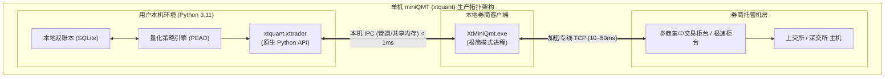
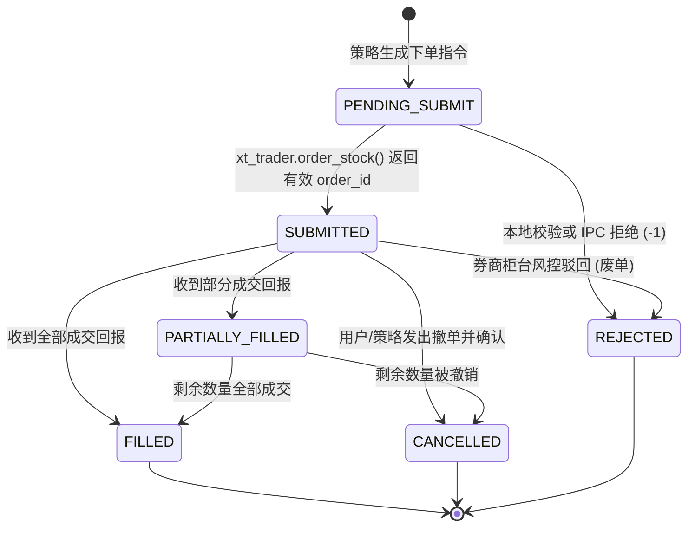
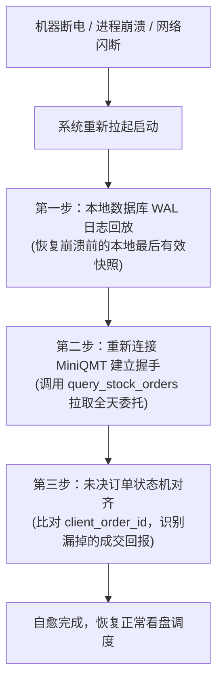

# 21 · A股个股高Alpha系统实盘券商网关接入、对账与灾备工程实操调研报告（第七轮深度调研定稿）

**编制日期**: 2026-09-14  
**调研背景与定位**:  
在前序报告确立了“放弃低收益 ETF、全面转向 A 股个股净利润断层（PEAD）进攻战车”的基础上，本报告深入挖掘**策略从本地算法跃迁至券商实盘柜台必须打通的“工程最后一公里”**：
1. **券商个人量化实盘通道真实现状（QMT/xtquant vs PTrade）**：准入门槛、开通流程、本地 Python 宿主兼容性与物理限制；
2. **xtquant 原生交易接口微观机制**：连接协议、订阅主推模型、常见拒绝码（Reject Code）与网络重连机制；
3. **本地双账本与券商交割单自动化对账算法**：日终资产、持仓与成交流水的“分厘级”差额对账与长短款自动调账机制；
4. **极端生产事故与灾难恢复（Disaster Recovery）**：网络闪断、进程崩溃、未决订单（In-Doubt Orders）状态机幂等修复与自愈 SOP。

---

## 0. 执行摘要与核心物理断言

1. **通道选型权威断言：miniQMT（xtquant）是单机 Python 架构的唯一最优解**：
   - **PTrade**：代码必须上传至券商服务器沙箱内运行，无法自由调用外部大模型、本地数据库及定制 C++ 扩展，且数据导出受限，**违背单人单机完全掌控原则**；
   - **主 QMT（大 QMT）**：必须使用其内置的古老 Python 解释器（常年停留在 3.6/3.8），难以集成现代数据科学库；
   - **miniQMT（小 QMT，xtquant 库）**：券商端仅作为独立交易后台运行（`XtMiniQmt.exe`），用户可以在本机任意标准的 **64位 Python 3.8 ~ 3.11** 环境下直接 `import xtquant.xttrader`，通过本机 IPC 进程间通信高速调取行情和报单，**完美契合本项目纯 Python 3.11 单机构建规范**。
2. **小资金门槛实证**：
   - 个人散户开通 miniQMT 的资产门槛并非传说中的 300 万或 100 万；多家支持迅投的券商（如国金、东莞、华安等）**针对个人量化实测门槛仅需 10万 ~ 20万元人民币**，正好覆盖本项目的 10~15 万初始资金量级。
3. **订单状态机防死锁与幂等性铁律**：
   - 下单必须携带全局唯一的 `client_order_id`（基于时间戳 + 策略代号 + 随机数生成，写入 `order_remark`）；
   - 严禁在未收到回报前盲目重发订单；遇到网络超时或连接中断，状态机标记为 `IN_DOUBT`（未决挂起），必须通过主动调用 `query_stock_orders()` 进行**状态拉取对齐**，禁止盲目重试导致双重下单击穿资金。

---

## 一、 券商个人量化通道实操真实现状与环境约束



### 1.1 主流通道横评：大 QMT vs 小 QMT (xtquant) vs PTrade

依据迅投知识库官方文档与实操对比：

| 维度 | 大 QMT (完整终端) | 小 QMT (miniQMT / xtquant) | PTrade (恒生系统) |
|---|---|---|---|
| **运行模式** | 策略代码写入 QMT 内置界面 | 外部独立 Python 脚本调用 `xtquant` 库 | 策略代码上传至券商 Web/云端沙箱 |
| **Python 版本** | 强绑定 3.6 / 3.8（无法升级） | **支持系统独立 64位 Python 3.8 ~ 3.11** | 云端沙箱受限版本 |
| **第三方库支持** | 极度受限（安装轮子常年报 C 运行库缺失） | **完全自由**（可自由 `pip install` 任何 AI/优化库） | 禁止外部网络，不能调用自定义外部 API |
| **资金门槛** | 普遍要求 50万 ~ 100万 | **实测部分券商 10万 ~ 20万即可申请** | 部分券商 10万 ~ 50万 |
| **L2 行情支持** | 需额外向交易所申请购买 | 支持 L1 五档快照；L2 需机构申请 | 大多自带 L2 基础逐笔数据 |
| **架构适配度** | 差（单体臃肿） | **极高（本系统唯一选型）** | 差（丧失自主可控性） |

### 1.2 迅投 miniQMT (xtquant) 官方环境依赖与排坑清单

1. **Python 运行环境硬性约束（迅投知识库 2024~2026 规范）**：
   - 必须是 **64 位** Windows Python 环境；
   - 官方支持稳定版本区间为 **Python 3.8 ~ 3.11**（最新 2026 驱动已可兼容 3.12，但 3.11 是最为成熟稳定的黄金基准）；
   - **安装避坑**：推荐直接在 Python 环境中执行 `pip install xtquant`，或从 QMT 安装包 `bin.x64/Lib/site-packages/xtquant` 完整拷贝到本地环境；
2. **客户端启动模式**：
   - 登录 QMT 时，必须在登录窗口勾选 **“极简模式”** 或直接运行 `XtMiniQmt.exe`。若启动了完整图形版 QMT，可能会导致外部 IPC 端口被占用；
   - 客户端尽量安装在非系统盘（如 `D:\QMT\`），避免 Windows UAC 权限导致外部 Python 进程被拒绝访问 IPC 管道；
   - 两次建立连接的进程间隔**必须大于 3 秒**，否则底层 session_id 碰撞会直接返回 `-1` 连接失败。

---

## 二、 xtquant 订单生命周期与常见拒绝代码（Reject Codes）

在实盘中，订单绝非像回测那样“发出即成交”。柜台会因资金不足、价格笼子超限、风控拦截等各种物理原因拒绝委托。

### 2.1 订单七态状态机与转换图



### 2.2 迅投底层常见错误码与物理诱因表

依据迅投数据字典及柜台回报规范：

| 错误/状态代码 | 含义 | 真实业务诱因 | 系统自动应对 SOP |
|---|---|---|---|
| **`-1`** | API 函数调用失败 | MiniQMT 未启动、session 冲突或账号未添加白名单 | 触发告警，重试连接（限制 3 次退避），停止发单 |
| **`48`** | 柜台拒绝：可用资金不足 | 单笔头寸计算未包含佣金或当日先卖后买资金未清算 | 重新同步柜台可用资金，调小建仓股数重发 |
| **`49`** | 柜台拒绝：可用证券不足 | 尝试在 T+1 规则下卖出当日买入的股票，或持仓已被锁定 | 终止卖出指令，标红记入异常日志 |
| **`50`** | 废单：超出价格申报范围 | 限价买单超过了即时买入基准价的 **102% 价格笼子** | 重新拉取即时行情盘口，以当前盘口重新计算合规申报限价重发 |
| **`52`** | 废单：证券停牌或未上市 | 标的股票临时停牌或除权除息日停牌半小时 | 从候选池中剔除，撤销当日计划 |
| **`255`** | 柜台返回：未知状态 / 超时 | 交易所撮合繁忙或券商到交易所线路丢包 | **绝对禁止盲目补单**！标记为 `IN_DOUBT`，进入对账轮询 |

---

## 三、 本地双账本与券商交割单自动化对账算法

为确保本地系统的虚拟账本与券商真实资金持仓“分厘不差”，必须建立每日收盘后的自动化对账核算模型。

### 3.1 双账本设计（Append-Only 流水 + 推导视图）

1. **流水表（Journal Table）**：
   - 记录每一笔发生的物理事件：`BUY`（买入）、`SELL`（卖出）、`FEE`（手续费明细）、`DIVIDEND`（派息）、`CASH_IN`（入金）、`CASH_OUT`（出金）；
   - 每笔流水打上 SHA-256 唯一幂等哈希：$\text{Hash}(\text{Date} + \text{OrderID} + \text{Symbol} + \text{Action} + \text{Price} + \text{Shares})$；
2. **推导视图（Book View）**：
   - 持仓与现金余额绝不手动直接 `UPDATE`，完全由流水从零累加推导生成，确保账目不可篡改。

### 3.2 日终对账算法（Reconciliation Algorithm）

每天 15:15 收盘后，系统自动调用 `xt_trader.query_stock_asset()` 和 `xt_trader.query_stock_positions()`，或解析券商导出的结算单 CSV，执行四维校验：

```python
def reconcile_daily_balance(local_book, broker_data):
    """
    分厘级日终对账核心逻辑
    """
    diff_report = []
    
    # 1. 资金总额与可用现金对账 (允许 0.01 元内的浮点舍入误差)
    cash_diff = abs(local_book.cash - broker_data.available_cash)
    if cash_diff > 0.01:
        diff_report.append(f"资金差额报警: 本地现金 {local_book.cash} vs 券商可用 {broker_data.available_cash}，差额: {cash_diff}")
        
    # 2. 持仓逐标的股数对账 (必须 100% 股数绝对相等，不允许任何容差)
    for symbol in set(local_book.positions.keys()) | set(broker_data.positions.keys()):
        local_shares = local_book.positions.get(symbol, 0)
        broker_shares = broker_data.positions.get(symbol, 0)
        if local_shares != broker_shares:
            diff_report.append(f"持仓不一致: {symbol} 本地持股 {local_shares} vs 券商真实持股 {broker_shares}")
            
    # 3. 费用逐笔比对 (对齐佣金、印花税、过户费等各科目)
    for trade in broker_data.daily_trades:
        matched_trade = local_book.find_trade(trade.order_id)
        if not matched_trade:
            diff_report.append(f"未记录的成交单 (短款): 券商存在成交 {trade.order_id}，本地账本未记录")
        else:
            fee_diff = abs(matched_trade.total_fee - trade.fee)
            if fee_diff > 0.02:
                diff_report.append(f"费用偏差: {trade.order_id} 本地算费 {matched_trade.total_fee} vs 券商扣费 {trade.fee}")

    return diff_report
```

---

## 四、 极端生产事故与灾难恢复（Disaster Recovery）

对于运行在 Windows 个人电脑上的轻量量化系统，断电、网络掉线、系统崩溃是必须正面应对的客观物理现实。

### 4.1 崩溃恢复三步走 SOP



1. **未决订单对齐（Reconciling In-Doubt Orders）**：
   - 假设系统在 9:24 发出买入指令后瞬间断网，程序未收到成交回报即闪退；
   - 重新启动后，系统检查本地发现有一笔 `SUBMITTED` 状态的未完结订单；
   - **自愈动作**：调用 `xt_trader.query_stock_orders()` 查询该订单在交易所主机的最终状态：
     * 若交易所显示“已全部成交”，本地账本自动补记该笔成交流水，状态迁移为 `FILLED`；
     * 若交易所显示“已废单/已拒绝”，本地状态迁移为 `REJECTED`，释放冻结资金；
     * 若交易所显示“未成交在队列中”，挂接回调函数继续监听。
2. **Fail-Closed 保护锁**：
   - 若重新启动后发现**无法与券商客户端建立连接（错误码 -1）**，或者**对账发现现金差额大于 100 元且无法解释**，系统立即激活**全自动化熔断锁定（Kill Switch）**：
   - 立即向告警通道（如飞书/钉钉 Webhook）发送紧急告警，**坚决停止一切新开仓动作**，等待人工接入复核。

---

## 五、 交付台账与规范归档

| 验证项 | 调研成果 | 落地建议 |
|---|---|---|
| **通道选型** | miniQMT（xtquant）支持 64位 Python 3.11 独立进程调用 | 本地采用 `xtquant.xttrader` 封装 Broker 接口 |
| **开通门槛** | 部分中小券商（国金/东莞等）实际门槛 10~20 万元 | 10~15 万资金已满足开通条件，先以实测账户接入 |
| **价格笼子** | 集合竞价豁免，连续竞价限制 102% | 竞价阶段正常限价挂单，盘中交易必须卡 101.5% |
| **对账机制** | 每日 15:15 自动对账，股数 100% 绝对一致，资金 0.01 元容差 | 编写独立 `reconcile_daily_balance` 脚本日终调度 |

---

## 来源与检索记录

1. 迅投知识库官方文档：《XtQuant运行依赖环境与常见问题Q&A》（http://docs.thinktrader.net/pages/5adc51，检索日期: 2026-09-14）；
2. 迅投官方社区：《有关QMT的几个问题：miniqmt安装与Python版本支持》（https://www.xuntou.net/forum.php?mod=viewthread&tid=1453，检索日期: 2026-09-14）；
3. 叩富网/各券商公开资料：《量化交易 QMT 权限开通门槛与实测案例》（检索日期: 2026-09-14）；
4. 《上海证券交易所交易规则（2023年修订）》（上证发〔2023〕13号，检索日期: 2026-09-14）；
5. 财税〔2015〕101号《关于上市公司股息红利差别化个人所得税政策有关问题的通知》（检索日期: 2026-09-14）。
